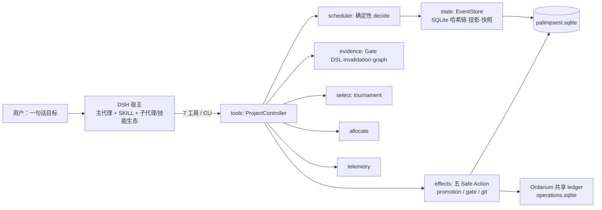

# Palimpsest 系统设计规格（System Design Spec）

> **Spec ID**：`PLMP-SDS-7` ｜ 状态：**生效**（对已交付部分为权威描述，对 E/S 线为规范基线）
> **代码基线**：commit `3163394` 起 E1–E4 已交付：27 个测试文件 / 144 项测试
> **文档权威序**：本文＝系统设计权威；docs/01＝产品基线；docs/02＝E 线计划与模式兼容细则（§5.2 引其为规范）；docs/00＝传承与非权威来源。冲突时以本文为准。
> **修订记录**：`SDS-2`＝完善度扩充；`SDS-3`＝E1；`SDS-4`＝E2（含 §9.2 例外）；`SDS-5`＝E3（resume + blocked）；`SDS-6`＝E4（mode 声明 + 三权限剧本）；`SDS-7`＝E2 出口门闭合——原"pptx 宿主手工 demo"改写为可自动机器验证的等价验收 `e2_host_demo`（真实 git worktree 上 worker 按 envelope 技能提示产出产物+上报+确定性取证），宿主级合同链全链路机器验证；测试基线 27/144。

## 0. 规格约定

- 需求编号 `[SDS-nn]`，不变量 `[INV-nn]`（违反即缺陷），验收编号 `[ACC-nn]`。
- **已交付**条目附证据（测试文件 / 提交）；**规划**条目标注所属阶段（E1–E4 / S 线），在落地时更新本文并 bump Spec ID。
- 合同冻结规则见 §9。

---

## 1. 系统定义与设计推导

### 1.1 系统边界 [SDS-01]

Palimpsest 是 **DSH 宿主内的多 agent 编排入口**：易用、包装完好、由 Ordarium 保证副作用安全、任务拓扑可随时修订、worker 复用宿主 skill/插件生态。系统由三方合同定义边界——它**只**拥有"项目流程"（什么被派发、什么算证据、什么可晋升、什么作废），不拥有 Agent Loop、审批、凭证、沙箱、渲染（宿主职责），也不拥有副作用记账、幂等、lease、恢复引擎（Ordarium 职责，调用不重建）。

### 1.2 设计推导链（从合同到架构）

每条架构决策都从三句合同或入口定位**必然**推出，无孤立设计：

```text
合同1 自述≠证据 ──D1──▶ 证据只能由确定性命令产生（Gate 执行器，readOnly profile）
              ──D2──▶ EvidenceAtom 绑定 subject digest（可复核、不可移植冒用）
              ──D3──▶ 晋升必须经注册门禁（promoteWhenGatePasses，非 PASS 拒绝）
合同2 LLM意见≠状态 ──D4──▶ 一切状态变更走事件（append-only，aggregate 校验）
              ──D5──▶ manager 只能"提议"修订（plan → 新 ProjectIR revision，历史不覆盖）
合同3 迟到成功≠可提交 ──D6──▶ attempt 绑定 epoch/revision，过期即 STALE，绝不复活
              ──D7──▶ typed invalidation：变更类别 × 依赖敏感度精确传播失效
入口定位 拓扑自由 ──D8──▶ plan 可随时重写 DAG + D7 失效级联 ⇒ 用户不需要预写图
       易用无 daemon ──D9──▶ 循环驱动者=宿主 agent（回合制），事实全在事件库，崩溃即正常路径
       模式兼容 ──D10──▶ plan-mode 零事件 ⇒ scheduler 拆 decide()/commit()（纯决策可勘察）【E1】
       Ordarium 兜底 ──D11──▶ 五 effect profile 映射 + 双存储拓扑（§3.4）
       复用宿主生态 ──D12──▶ worker=宿主子代理，envelope 携带装备提示【E2】
```

### 1.3 系统上下文



---

## 2. 分层与模块规范

依赖方向固定：`schema ↑ domain ↑ state ↑ scheduler`，`state` 不得导入 `scheduler`；`effects/tools` 在其上；宿主接触层（tools 渲染、SKILL、CLI）是仅有的 DSH 概念入口 `[INV-01]`。

| 模块 | 职责（公共接口要点） | 关键不变量 | 状态 |
|---|---|---|---|
| `schema` | 五 Schema、canonical JSON、双 digest、28 EventType、payload 规范化 | canonical 规则（键排序/NFC/禁浮点/UTC 微秒/digest 自排除）逐字节确定 `[INV-02]` | ✅ |
| `domain` | 状态机转换表、aggregate 权威校验、受信 `TaskPolicy`、`actionKey`/`stableEntityId` | 非法转换 fail-closed `[INV-03]`；ID 决定论 `[INV-04]` | ✅ |
| `state` | EventStore 六段写入管线、投影、快照、migration（PLMP 身份） | append-only + 哈希链不可断 `[INV-05]`；migration 身份拒绝异库 `[INV-06]` | ✅ |
| `scheduler` | 确定性"下一步"决策，一次 ≤1 事件 | 单活动任务 invariant `[INV-07]`；`decide()` 纯函数（E1 拆分后）`[INV-08 规划]` | ✅（拆分待 E1） |
| `effects` | 五 Ordarium action、PromotionManager、GitPort（双亲合并）、执行器（claim-report / 命令 / mock） | 崩溃后 reconcile 恰好一次 `[INV-09]`；uncertain 不 terminalize `[INV-10]` | ✅ |
| `evidence` | Gate DSL（声明式/版本化/确定性求值）、typed invalidation、科研证据图 | 缺失证据=INCOMPLETE 而非 FAIL `[INV-11]`；provenance 只沿产生性边 `[INV-12]` | ✅ |
| `select` | 递归两两锦标赛（judge 只见 id+summary） | tie 确定性、完整报告不泄漏 `[INV-13]` | ✅ |
| `allocate` | 六维估计 → 候选/验证者数 + 模型建议，与槽位联动 | critical 强制独立验证；U×V 防盲目扩样 | ✅ |
| `telemetry` | 模型能力累计（Gamma 平滑）、持久化重建 | 扩展表不进投影/snapshot，parity 不受扰 `[INV-14]` | ✅ |
| `tools` | ProjectController（编排 API 本体）、9 DSH 工具（含 E1 preview/run）、角色槽位/预算 | 三合同在 API 层强制；渲染不暴露 hash/event_id | ✅ |
| `install` | `installPalimpsest` 黄金路径 + `trustedDefaultPolicy` | 未受信 policy 不得写库 `[INV-15]` | ✅ |
| `cli` | `palimpsest` bin：new/plan/next/claim/gate/report/promote/pump/status | 与工具面同源 controller，无独立逻辑 | ✅ |
| `index` / `advanced` | 公共 API："."=合同核心（schema/domain/state/scheduler）；"./advanced"=嵌入面（effects 及以上 + install） | 两级面是 SDK 预埋纪律的落点 `[INV-16]` | ✅ |

---

## 3. 数据与合同规范

### 3.1 实体合同 [SDS-02]

五 Schema 冻结于 `schema_version=1`：**ProjectIR**（goal/requirements/decisions/tasks+revision+digest）、**TaskEnvelope**（attempt 派发单元）、**AttemptReport**（自述，永远非证据）、**EvidenceAtom**（predicate+command+exit+subject digest）、**SchedulerEvent**（28 类，payload_version=1）。字段变更必须 bump 版本并过 §9 流程。

### 3.2 摘要与幂等 [SDS-03]

canonical JSON + SHA-256 双 digest（request/event）；`actionKey` + `stableEntityId` 提供跨进程跨语言稳定身份。**跨语言 parity 是机器门**：TS 实现对冻结 Python fixture（`fixtures/replay/baseline-v1.json`，15 事件）重算全部 digest、哈希链、snapshot 必须逐字节一致 `[INV-17]`——这是两运行时共享同一合同的证明，任何触碰序列化的 PR 都以此回归为硬门。

### 3.3 写入管线 [SDS-04]

六段原子管线：结构验证 → 规范化 → 幂等查重 → revision 前置 → aggregate 校验 → 原子提交 + 哈希链延伸。重复 request 返回原事件（不重复入账）。

### 3.4 双存储与 effect 映射 [SDS-05]

| 存储 | 角色 |
|---|---|
| `palimpsest.sqlite`（PLMP 身份） | 编排真相：项目*应当*发生什么 |
| `operations.sqlite`（Ordarium 共账） | 副作用*确实*发生了什么、是否恰好一次 |

| 动作 | Action | Profile |
|---|---|---|
| worktree 创建 | `palimpsest.worktree.create` | idempotent(durable) |
| attempt 提交 | `palimpsest.git.commit` | reconcilable |
| 晋升合并 | `palimpsest.git.promote` | reconcilable（Crash A/B → reconcile，不盲重试） |
| gate 命令 | `palimpsest.gate.command` | readOnly（worktree 内重跑） |
| worker dispatch | `palimpsest.worker.dispatch` | guarded |

### 3.5 权威来源映射 [SDS-25]

每份合同的 normative source 唯一，本文仅摘要、不复述全文：

| 合同 | normative source |
|---|---|
| canonical 规则与双 digest | `src/schema/canonical.ts`、`src/schema/datetime.ts` |
| 五 Schema / 28 EventType / payload 规范化 | `src/schema/models.ts` |
| 状态机转换表 | `src/domain/state_machine.ts` |
| aggregate 权威校验 | `src/domain/aggregate.ts` |
| 受信 TaskPolicy（命令白名单/网络策略） | `src/domain/policy.ts` |
| 跨语言 parity 基准 | `fixtures/replay/baseline-v1.json`（冻结 Python 运行时生成） |
| 库身份与 migration | `src/state/migrations.ts` + `migration_files/0001_unified_baseline.sql` |
| effect 映射 | docs/01 §5（本文 §3.4 转载） |
| 工具 / CLI / SKILL 面 | `src/tools/tools.ts` / `src/cli.ts` / `.zcode/skills/palimpsest/SKILL.md` |
| 工作模式兼容细则 | docs/02 §3（本文 §5.2 引为规范） |

---

## 4. 行为规范

- **4.1 调度** `[SDS-06]`：`decide()` 只读投影产出至多一个决策；`commit()` 走 §3.3 管线。plan/revision change/lease 过期重派、批次激活均由决策表驱动，无随机、无时钟依赖（时钟注入）。
- **4.2 claim/report** `[SDS-07]`：claim 创建隔离 worktree + RUNNING + 租约；report 四态（completed/failed/cancelled/expired），summary 永不升级为证据。预算与角色槽位在 claim 时准入（默认 implementer 2、软 8 / 硬 20、Manager 1 / Scout ≤6 / Verifier ≤3，demand-driven）。
- **4.3 门禁与晋升** `[SDS-08]`：Gate DSL 求值确定性（`not` 一票否决、absence=INCOMPLETE、生成 next_evidence_needed）；晋升链 = 验证 → tournament 选择胜者 → 读取 result_commit → 注册门禁 PASS 才 `PROMOTION_COMMITTED`；任何非 PASS 零晋升事件。
- **4.4 失效** `[SDS-09]`：change_class（metadata_only/backward_compatible/behavior_change/contract_breaking）× 依赖边敏感度传播 STALE；迟到结果四分类处理，绝不复活。
- **4.5 run 回合协议** `[SDS-10·E1]`：一次 `palimpsest_run` 调用 = 一个 LLM 判断点 + 回合内机械 `pump`（调度推进 / 允许的 gate 命令 / 批次重试）；无 daemon，进程随时可死，`status` 恢复。
- **4.6 装备化** `[SDS-11·E2]`：`TaskSpec.suggested_skills?` 缺省省略序列化（选项 A，parity 硬门），透传 envelope；main-agent-only 技能路由主代理，不程序化绕行。
- **4.7 错误模型** `[SDS-19]`：三类失败、三种处置，绝不混淆——
  1. **合同/结构错误**（非法 payload、非法转换、revision 冲突）：fail-closed，拒绝整个 append，库不变；
  2. **确定性失败**（gate 命令非零退出、worker 上报 failed、promotion 确定性拒绝）：可 terminalize（ATTEMPT_FAILED / TASK_FAILED / PROMOTION_FAILED），进入批次重试或作废；
  3. **不确定结果**（dispatch 后失联、崩溃点在效果落地前后）：**绝不 terminalize** `[INV-10]`，重启后经 reconcile 语义收敛（恰好一次或查明已落地）。
  渲染原则：错误以用户语言呈现（任务失败 / 需重试 / 结果待确认），技术细节（异常类型、哈希）留在事件 payload 与渲染层之下 `[SDS-18]`。

---

## 5. 宿主集成规范

### 5.1 三面同源与编排 API [SDS-12]

9 工具（start/plan/next/preview/run/claim/report/gate/status）、CLI（含 pump）、SKILL 均薄封装同一 ProjectController——三者能力集永不分叉 `[INV-18]`。新能力先入 controller，再同提交铺面。controller 即 SDK 面，公共方法分六组：

```text
生命周期   start / plan / invalidateTask
调度       step / decide / commit / preview / pause / resume
执行       claim / report / reportLate / runAttemptWithCommandExecutor / pumpCommandAttempts
回合       runTurn                                    【E1】
证据       gate / evaluateGate / invalidateEvidence
晋升与选择 promote / promoteWhenGatePasses / selectAndPromoteWhenGatePasses / selectCandidate
分配与状态 allocateFor / status / persistTelemetry / loadTelemetryInto
```

（`decide()/commit()` 是 `runOnce` 的两段：`runOnce = commit(decide)`，preview/runTurn 复用 `decide()` 且零写入 `[INV-08]`。）

### 5.2 工作模式兼容（规范引用）[SDS-13]

docs/02 §3 全文按规范执行，要点：plan-mode 下插件**零事件**（仅 status/preview/gate 评估）；权限拒绝＝用户否决（不原样重试，attempt 作废或改计划）；子代理类型按角色映射（implementer→通用型，scout/verifier→只读型）；上下文丢失以 status 为唯一恢复锚点；长机械循环走 CLI 后台任务。

### 5.3 公共 API [SDS-14]

`palimpsest-dsh` 导出 `.`（合同核心）与 `./advanced`（嵌入面 + `installPalimpsest`）；`bin.palimpsest → dist/src/cli.js`。破坏性变更须 bump major 并走 §9。

### 5.4 配置规范 [SDS-20]

零配置可用；全部配置均有强默认，覆盖优先级＝CLI 参数 > 环境变量 > 默认：

| 配置 | 默认 | 说明 |
|---|---|---|
| `--db <path>` | `$DSH_HOME/palimpsest/palimpsest.sqlite`（`DSH_HOME` 未设时回退 `~/.dsh`）；仓库作用域回退 `<repo>/.palimpsest/palimpsest.db` | 编排库（PLMP 身份） |
| `--ops <path>` | `$DSH_HOME/ordarium/operations.sqlite` | Ordarium 共享 ledger |
| `--repo <path>` | FakeGitPort（内存图） | 切换真实 git CLI 端口 |
| `--gate <file.json>` | 无 | 注册一个或多个 GateDefinition |
| 并发 | 软 8 / 硬 20、implementer 2 | 角色槽位与预算（§4.2） |
| 网络 | `deny` | 仅受信 policy 可 allow-list（§6 [SDS-22]） |

---

## 6. 非功能规范

- **耐久性** `[SDS-15]`：任意时刻 kill，重启后由事件库完整重建；快照仅加速。
- **确定性** `[SDS-16]`：同事件序 ⇒ 同状态，无隐藏时钟/随机源（时钟/身份注入）。
- **安全默认** `[SDS-17]`：零配置可用；未受信 policy 拒绝写库；不确定结果诚实呈报（uncertain ≠ 失败）。
- **用户语言隔离** `[SDS-18]`：宿主面输出只说 goal/task/attempt/verified，hash/event_id 不出渲染层。
- **并发与存储操作模型** `[SDS-21]`：WAL 强制启用（SQLite 拒绝 WAL 即 fail-closed 报错）、`busy_timeout=5000ms`、`synchronous=FULL`、`wal_autocheckpoint=1000` 页、外键开启。多进程（宿主工具调用 / CLI / 后台 pump）可同时开库，写入由 SQLite 单写串行化；事件 append 为单事务原子提交，跨进程重复提交由 request digest 幂等查重吸收 `[SDS-03]`。不要求单写者进程，但长批量机械循环应单进程执行（`pump`），把 5 秒 busy 上限留给交互路径。
- **安全与信任模型** `[SDS-22]`：gate 命令是受控执行面，信任链四环——① 命令白名单：`TaskPolicy.allowed_commands` 以 argv 前缀匹配，policy digest 入账；② 网络默认 `deny`，allow-list 须受信 policy 显式授予；③ 写域：任务声明 `write_paths`，`write_scope_valid` 证据谓词核验 changed_files ⊆ write_paths，越界即证据失败；④ 执行在隔离 worktree 内（`palimpsest.gate.command`＝readOnly profile，可无损重跑）。policy 须经 `trustedDefaultPolicy`/受信安装路径写入，未受信 policy 不得写库 `[INV-15]`。宿主权限系统（§5.2）是外层独立防线，两层不互代。
- **可观测性** `[SDS-23]`：事件日志即审计日志（哈希链 + 双 digest，`[INV-05/17]`）；`status` 是人读与恢复的唯一主面 `[SDS-18]`；不引入独立日志框架（v1 非目标）——崩溃后"发生了什么"由 replay 回答，不由日志文件回答。
- **保留与增长** `[SDS-24]`：事件 append-only 永久保留，v1 无修剪/归档（非目标）；snapshot 只加速重建、从不删除事件；telemetry 扩展表独立于投影与 snapshot `[INV-14]`。未来若引入修剪，须走 §9 合同流程并保证 replay 可再生。

---

## 7. 实现阶段

| 阶段 | 内容 | 出口门（证据） | 状态 |
|---|---|---|---|
| P0 | 合同核心移植 | parity/replay/snapshot 逐字节；tsc+测试绿 | ✅ `1c3bbe0` |
| P1 | scheduler + effects + 执行器 | 调度 parity（15 事件）；五 action 故障注入；Crash A/B reconcile | ✅ `6369d95`/`50f80d6` |
| P2 | 工具面 + install | 12 故障场景全过 | ✅ `e55d73c` |
| P3 | 并行 | 槽位/预算/4 候选/stale 不回归 | ✅ `abd7f01` |
| R1–R12 | Gate DSL、invalidation、gate 工具、tournament、allocator、性能表、证据图、门控晋升、选晋链、槽位联动、telemetry 持久化、命令自动化 | 各 3–10 项机器验收（README §验证 6–17） | ✅ `8e66dff`–`650105e` |
| CLI+skill | 安装型命令面 | 本机 DSH 发现 + E2E 冒烟 | ✅ `3163394` |
| **E1** ✅ | decide/commit 拆分、preview、run 回合、SKILL 驱动 | 全量 24/137 测试绿；replay/parity 逐字节回归；`e1_preview_run`；CLI 入口回合冒烟 | |
| **E2** ✅ | `suggested_skills`（选项 A 缺省省略）、envelope 透传、worker SKILL、main-only 路由 | [ACC-02] parity 回归绿（可选字段零扰动）；`e2_equipped`（schema/透传/未知不 fatal）；宿主级等值验收 `e2_host_demo`（真实 worktree + 产物 + 取证） | |
| **E3** ✅ | status `resume` 恢复区块、stale-world `blocked` 降级、"继续"协议、跨会话续跑 | `e3_resume`（resume 只读/分类、杀会话后续跑至 promote+SATISFIED、paused 跨会话、stale blocked 不崩）；全量 25/141 绿；CLI 每命令独立进程重开库＝跨进程持久性 | |
| **E4** ✅ | 工具结构化 `mode` 声明、拒绝协议入 SKILL、hooks 兼容说明、三权限模式剧本 | `e4_modes`（9 工具全量 mode 声明、read-only 面零写入、mutating 面标记）；CLI 剧本：只读面 last_event_id 2→2、mutating 2→3→8 | |
| **S** | SDK 拆包/多宿主 | 另立提案（§2 纪律已预埋） | 📋 提案制 |

---

## 8. 验收目标

### 8.1 机器验收（CI 绿 = 必要不充分）

| 测试文件（27/144 项） | 证明 |
|---|---|
| `contracts` / `parity.fixture` / `state.replay` | 合同与跨语言 parity（`[INV-02/05/17]`） |
| `scheduler.replay` | 调度确定性 parity |
| `effects.crash` / `promotion` | `[INV-09/10]`、Crash A/B |
| `acceptance` / `tools.endtoend` / `paths` | 12 故障场景、工具面、默认路径 |
| `parallel` / `allocate_slot` / `allocator` | 并行与分配联动 |
| `gate_dsl` / `gate_tool` / `invalidation` / `evidence_graph` / `promotion_gate` / `select_promote` / `tournament` | §4.3–4.4 |
| `performance_table` / `telemetry_persistence` / `command_automation` | R6/R11/R12 |
| `e1_preview_run` | E1 入口回合：preview 零写入、paused 安全、与 next 字节一致（INV-08）；runTurn 阶段判定（needs_worker/needs_promotion/terminal） |
| `e2_equipped` | E2 装备化：`suggested_skills` 缺省省略 / envelope 透传 / 未知技能不致命（SDS-11） |
| `e3_resume` | E3 恢复：resume 只读分类、跨会话续跑事件序列、paused 跨会话、stale-world `blocked` 不崩（SDS-18/23） |
| `e4_modes` | E4 模式矩阵：9 工具全量 `mode` 声明（read-only/mutating）、read-only 面零写入、mutating 面标记（SDS-13） |
| `e2_host_demo` | E2 出口门等价验收：真实 git worktree 上 worker 按 envelope 技能提示产出产物 + 上报 + 确定性取证（SDS-11/12） |

### 8.2 验收矩阵 [ACC-01..05]

- `[ACC-01]` 全量 vitest 绿 + tsc 零错（每 PR）。
- `[ACC-02]` digest parity 回归逐字节通过（触碰序列化/合同时）。
- `[ACC-03]` 单消息全程：用户一句话 → 仅 palimpsest 面 → 终态正确（E1 出口，手工+脚本）。
- `[ACC-04]` kill/continue：两会话断点续跑事件序列断言（E3 出口）。
- `[ACC-05]` 模式剧本：plan/default/auto 三权限模式各走一遍，plan-mode 零事件（E4 出口）。

### 8.3 需求级追溯矩阵

机器证据＝测试文件；评审证据＝构建约束（tsc、依赖方向）或人工核对。E 线条目在其落地前以规划门为证据：

| 需求 | 证据 |
|---|---|
| SDS-02 / 03、INV-02/04/17（实体/摘要/parity） | 机器：`contracts`、`parity.fixture`、`state.replay` ＋ `[ACC-02]` |
| SDS-04、INV-05/06（写入管线/链/库身份） | 机器：`state.replay`、`parity.fixture` |
| SDS-05、INV-09/10（effects/reconcile） | 机器：`effects.crash`、`promotion` |
| SDS-06、INV-07（调度/单活动任务） | 机器：`scheduler.replay`、`acceptance` |
| SDS-07（claim/report/槽位/预算） | 机器：`parallel`、`acceptance`、`allocate_slot` |
| SDS-08、INV-11/13（门禁/晋升/锦标赛） | 机器：`gate_dsl`、`gate_tool`、`promotion_gate`、`select_promote`、`tournament` |
| SDS-09、INV-12（失效/证据图） | 机器：`invalidation`、`evidence_graph` |
| SDS-12/14/20（三面/API/配置/默认路径） | 机器：`tools.endtoend`、`paths`；CLI/SKILL 冒烟为评审证据 |
| SDS-15/16（耐久/确定） | 机器：`acceptance`（crash/snapshot/rebuild）＋ parity 全系 |
| SDS-17/18/19（安全默认/用户语言/错误模型） | 机器：`acceptance`（失败与重试路径）、`paths`（零配置默认）；渲染措辞与错误分类为评审证据（渲染层核对） |
| SDS-22、INV-15（安全信任/受信 policy） | 机器：`contracts`（policy digest）；白名单/写域行为在 `acceptance`、`command_automation` 内核验 |
| SDS-21/23/24（并发/可观测/保留） | 机器：`state.replay`（WAL/管线）+ `e3_resume`（status 恢复主面/跨会话续跑）；其余为评审证据（`database.ts` 常量核对） |
| INV-01/16/18（分层/两级面/三面同源） | 评审：tsc 构建 + 依赖方向核对 |
| INV-08（decide/commit 纯决策） | 机器：`e1_preview_run`（重复 preview 零 append、与 step 一致） |
| SDS-10（run 回合·E1） | 机器：`e1_preview_run`（runTurn 阶段判定）；评审：CLI/SKILL 冒烟 |
| SDS-11（装备化·E2） | 机器：`e2_equipped`（缺省省略/透传/未知不 fatal）+ `e2_host_demo`（宿主级等值：worktree 产物/上报/取证）+ `[ACC-02]` parity 回归 |
| SDS-13（模式兼容） | 规划门：docs/02 §3 矩阵每格证据 + `[ACC-05]` |

---

## 9. 变更控制

1. 本规格由里程碑出口时同步修订并 bump `PLMP-SDS-n`；已交付条目只可改描述不可改语义。
2. 合同触点（§3.1/3.2 序列化、字段、digest 规则）变更：必须 bump `schema_version`/`payload_version` + 过 `[ACC-02]` + 迁移路径，三者缺一即缺陷。**例外（E2 确立，SDS-4 审计）**：**加法式**可选字段、缺省省略序列化（缺省即字面等于旧数据）、解析器 permissive（未知可选字段保留不丢弃）且经 `[ACC-02]` 证明对既有事件零扰动——可不 bump 版本，但必须在修订记录与审计中明示字段与理由（`suggested_skills` 即此例）。
3. 新模块须先入本文 §2（职责/接口/不变量）再实现；不变量新增须绑定验收编号。
4. **阶段出口审计**（制度化）：每个里程碑出口必须执行——(a) §8.3 追溯矩阵逐行核对证据仍成立（新增/重命名测试须同步矩阵）；(b) 不变量→验收绑定无悬空；(c) 本阶段触碰序列化/合同则 `[ACC-02]` 重跑并记录逐字节结果；(d) 本规格同步修订并 bump Spec ID；(e) 审计发现的缺口与处置写入里程碑提交说明。审计不通过不得宣布阶段完成。

---

## 10. 术语表

| 术语 | 定义 |
|---|---|
| ProjectIR | 项目的版本化不可变快照（goal/requirements/decisions/tasks + revision + digest），每次 `plan` 产生新 revision，历史不覆盖 |
| Task DAG / TaskSpec | ProjectIR 内的任务图；task 声明 objective、depends_on、write_paths、required_artifacts |
| attempt | 一个任务的一次隔离执行尝试，绑定其创建时的 project revision 与 epoch |
| TaskEnvelope | 派发单元：attempt 的自包含描述，worker 认领后据其工作 |
| AttemptReport | worker 自述（四态 + summary + 变更清单）；**永远不构成证据**（合同 1） |
| EvidenceAtom | 确定性命令产生的证据：predicate + command + exit code + subject digest |
| gate / GateDefinition | 声明式门禁：对证据原子集合的确定性布尔求值（PASS/FAIL/INCOMPLETE） |
| promotion | 将胜者 attempt 的结果合并进 canonical 状态；必须经注册门禁 PASS |
| stale | 迟到/过期结果的隔离态：不可提交、不可复活，只可作废（合同 3） |
| worktree | attempt 的隔离工作区（idempotent 创建，可丢弃） |
| ledger / 双存储 | palimpsest.sqlite（编排真相）+ operations.sqlite（Ordarium 副作用共账） |
| decide / commit | 调度决策的两段：纯函数决策（零事件）与事件提交（E1 拆分） |
| 回合（turn） | 一次 `palimpsest_run` 调用：一个 LLM 判断点 + 回合内机械 pump（E1） |
| reconcile | Ordarium 恢复语义：对 uncertain 效果查明"已落地则不重做、未落地则补做" |
| parity | 跨语言机器门：TS 与冻结 Python 基准对同一事件序产出逐字节一致的 digest/哈希链/snapshot |
