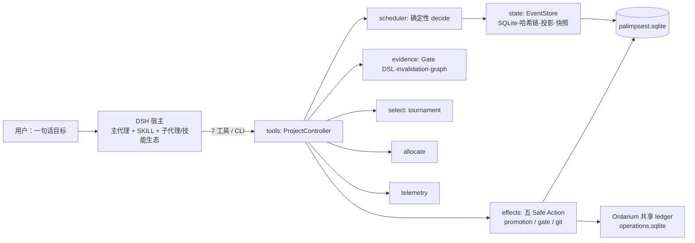

# Palimpsest 系统设计规格（System Design Spec）

> **Spec ID**：`PLMP-SDS-16` ｜ 状态：**生效**（对已交付部分为权威描述，对 E/S 线为规范基线）
> **代码基线**：commit `47969bb` 起 E1–E4 与 H1 审计整改已交付；SDS-9–SDS-28（Ordarium 1.1.0→1.2.0 bump、telemetry 外置、遥测驱动分配、模型推荐咨询面、status 遥测视图、Context Brief、Host Adapter conformance、检索半边、semantic 检索通道、Boot/Pull 分发、可视化编排面、架构三模式、呈现适配线、架构预设库、Agent 画布、Canvas 完整性、稳定图身份、AgentGraph IR、GraphPatch、Runtime Subgraph v1、Ready-Set 调度、Unified Runtime Graph、Debugger 控制面 v1）后 51 个测试文件 / 305 项测试
> **文档权威序**：本文＝系统设计权威；docs/01＝产品基线；docs/02＝E 线计划与模式兼容细则（§5.2 引其为规范）；docs/00＝传承与非权威来源。冲突时以本文为准。
> **修订记录**：`SDS-2`＝完善度扩充；`SDS-3`＝E1；`SDS-4`＝E2（含 §9.2 例外）；`SDS-5`＝E3（resume + blocked）；`SDS-6`＝E4（mode 声明 + 三权限剧本）；`SDS-7`＝E2 出口门闭合——原"pptx 宿主手工 demo"改写为可自动机器验证的等价验收 `e2_host_demo`（真实 git worktree 上 worker 按 envelope 技能提示产出产物+上报+确定性取证），宿主级合同链全链路机器验证；测试基线 27/144；`SDS-8`＝H1 审计整改交付（06 规格全案）——治理三层上链：`GATE_DEFINED`/`ROLE_TABLE_DEFINED`/`STAGE_GRAPH_DEFINED` 声明事件，genesis 默认角色表 + 默认阶段图随 `start()` 逐字声明；调度器解释声明图（ACTIVE/VERIFYING 锁存、BLOCKED/READY 扫描、声明 guard 复用门禁 DSL 子句、缺证据＝停摆绝不视为通过）；选拔器官声明制判官（`JUDGE_DECLARED`/`CANDIDATE_SELECTED`，未声明判官 fail-closed）；恢复器官（PromotionRecoveryService 清点 PREPARED 孤儿入 `status.resume`）；基线 fixture v2（16 事件，TS 运行时再生——`PROJECT_CREATED` 后即 genesis 阶段图声明）；构造器内存选项 `parallel`/`gates` 移除（声明即唯一真相，不留兼容层）；测试基线 27/144 → 31/165；`SDS-9`＝Ordarium 1.1.0 pin bump（07 升级协议全链执行）——`SqliteLedger` 打开退避在消费 seam 显式钉住 `{attempts:5, delayMs:100}`（ALN-3 显式钉住件，不依赖上游默认）；原生 v2 账本 fixture（`fixtures/ordarium/ledger-v2.sqlite`）打开迁移断言 + busy 边界四态断言在册（`test/ordarium_ledger.test.ts`）；`tools/sync-ordarium.mjs` 退役；测试基线 31/165 → 32/170；`SDS-10`＝telemetry 外置试点（PLMP-TLM-1，08 规格）——`ModelPerformanceTable` 持久层外置到 Ordarium 管理型 state kind（append-delta 主体 + list 聚合装载；`PalimpsestEffectsRuntime.state`＝唯一消费门面，`createStateStore({runtime})` 绑定 quiesce 闸门），`StateRevisionConflictError` 按 instanceof 归 busy 族（`isStateRevisionConflict`），旧 `palimpsest_telemetry` 扩展表路径退役（无兼容层，孤儿表声明在案）；`ModelStat` 增 `cost` 字段 + `addAggregated()` 注入面；测试基线 32/170 → 32/173（TLM-A01–A06）；`SDS-11`＝遥测驱动自适应分配接线（PLMP-ALC-1，09 规格 r1）——宿主层归因（`claim`/`pump` 可选 attribution，事件契约零触碰）、证据面结算（`evaluateAttemptGate` 漏斗：PASS→success / FAIL→failure / INCOMPLETE 不记，worker 自述永不计成功）、保守重映射（`adjustAllocation` 纯函数：加宽/升档/降档三分区 + 硬 guard 镜像，[ALC-INV-1..6]，`allocate()` 本体零改动）、pump 边界自动 flush（失败浮出、幂等增量不丢）；测试基线 32/173 → 33/185（ALC-A01–A11）；`SDS-12`＝模型推荐咨询面（PLMP-ALC-2，10 规格）——`allocateFor` 咨询臂（可选 `modelCandidates` 入参 + `suggestedModel`/`suggestedModelReason` 加法式可选返回），R6 `bestModel` 排名原样复用，新增性质为诚实门控 [ADV-G1..3]（per-model ≥ `MODEL_MIN_ATTEMPTS`=8、零成本弃权、先验回退标注 basis）；宿主仍自选模型，事件契约与 7 工具面零触碰；测试基线 33/185 → 34/193（ADV-A01–A06）；`SDS-13`＝status 遥测视图（PLMP-TLM-2，11 规格）——`ControllerStatusView` 加法式可选 `telemetry` 节（人话格式：平滑成功率为百分比、成本四位小数），冷表缺席，术语隔离红线机器守门（七字段恰定）；工具**集合**冻结不动，status 内容生长循 H1 `resume` 先例；测试基线 34/193 → 34/196（STV-A01–A03）；`SDS-14`＝Context Brief（PLMP-CTX-1，12 规格，R16）——知识闭环第四模块的 C2 切片：`compileContextBrief` 纯函数（facts 与证据 1:1 零摘要 / interpretations 自述隔离 / conflicts 双侧并列不平均，[CTX-INV-1..5]）+ `contextBrief(taskId?)` 只读咨询面（永不落账，事件数与 snapshotDigest 不变性机器守门）；检索半边（requirement/hybrid retrieval/manifest/coverage）另立项；测试基线 34/196 → 35/202（CTX-A01–A06）；`SDS-15`＝Host Adapter conformance（PLMP-CONF-1，13 规格，ALN-4② 兑现）——Ordarium 1.2.0 bump（新增 `@ordarium/host-kit` 依赖线）后装配期握手（`assertHostContract(1)` 字面量钉住，错代数 fail-closed）+ `hostPort` 全直通映射（HostInvocation≡ActionRunOptions）+ `runHostAdapterConformance` 四场景全过（scratch 账本令）；测试基线 35/202 → 36/205（CONF-A01–A04）；`SDS-16`＝Context 检索半边（PLMP-CTX-2，14 规格，R18，两项用户裁决：含词法检索、manifest 进 canonical 审计链）——Requirement 编译器（五类结构性派生，forbidden＝R2 stale 集直引）、`GitPort.scanLexical` 只读词法检索（Fake/CLI 双实现）、Coverage Assessment（0.75 建议阈值，advisory）、**schema 触点**：`CONTEXT_MANIFEST_ADDED` 新事件（EVENT_TYPES 33→34 + MIGRATION_5 `context_manifests` 投影表 + snapshotDigest 变更 → fixture v3 再生）、`AttemptReport` 加法式可选 `context_manifest`（SDS-4 例外，缺省键省略保持既有 digest 逐字节不变）、`compileTaskContext(attemptId)` 幂等编译 + report 自动回填；测试基线 36/205 → 36/213（CTX2-A01–A10）；`SDS-17`＝semantic 检索通道（PLMP-CTX-3，15 规格，R20）——`EmbeddingPort` 宿主注入边界（真实 embedding 永远来自宿主，本仓只定义端口与确定性参考实现）+ `hashingEmbedder`（64 维 token-hash 桶、原始计数向量）+ `GitPort.collectWorktreeTexts` 原料面（.git 跳过、1MB/64 文件/64KB 上限）+ controller semantic 通道接线（文件级 cosine top-k、`score_permille`、同 body digest 去重）+ `manifest.semantic` 加法式可选字段（无 port 时键缺席，`retrieval` 仅 `["lexical"]`，事件契约零触碰）；数据门槛已由实证累积满足（28 attempts，07 r11/r12）；`SDS-18`＝Boot/Pull 上下文分发（PLMP-CTX-4，16 规格，R21）——`distributeContext` 纯派生（exact 恒 boot、source/evidence 依 manifest 序填充字节预算、溢出转 pull 句柄；缺省预算 40960 字节）+ 三类句柄语法 `@ctx/exact|source|evidence/<ref>`（excluded_stale 永不分发）+ `fetchContext` 句柄解析面（boot+handles 合并查找、evidence body 取自投影、未知句柄 undefined——句柄是咨询索引不是合同断言）；manifest 本体零改动，分发前后事件数与 snapshotDigest 不变；测试基线 36/213 → 39/224（CTX3-A01–A05 + CTX4-A01–A05）；`SDS-19`＝可视化编排面（PLMP-VIS-1/2，17 规格，R22，四项用户裁决：内核面先行、双图主形态＝计划图+运行时间线、渲染器为同一契约适配器〔dshweb/dshtui/dsh-winui〕）——`orchestrationGraph()` 只读投影（计划图 depends_on 边 + 每 attempt 人话时间线含重试链 + 晋升折叠 + 在途归因徽章 + 不透明轮询游标；术语隔离机器守门——JSON 零 event_id/哈希）+ `definePalimpsestControl` 控制映射面（每操作恰委托一个既有 controller 方法，promote 复用 CLI promote 组合原样）；传输归客户端（内核零 SSE，游标廉价轮询）；`SDS-20`＝架构三模式（PLMP-ARCH-1/2，18 规格，R23，两项用户裁决：**DSH 主代理当架构师**〔插件零内嵌 LLM，宿主中立红线〕、首批 preset＝**流水线**）——`pipelinePreset` 线性阶段链 + `ProjectProposal` 共享校验器（六类诊断 fail-closed：EMPTY_TASKS/EMPTY_TITLE/UNKNOWN_DEPENDENCY/DEPENDENCY_CYCLE/MISSING_WRITE_PATHS/UNKNOWN_GATE）+ `proposalTaskSpecs` 确定性编译；声明只走既有 start/plan 通道（架构调整即计划修订，晋升门禁治理不变）；CLI 增 `architect` 命令（校验→空诊断才 `--declare`）+ 架构师技能 `.zcode/skills/palimpsest-architect/`；测试基线 39/224 → 41/237（VIS-A01–A07 + ARCH-A01–A05）；`SDS-26`＝呈现适配线（PLMP-WEB-1/2 + PLMP-TUI-1 + PLMP-WINUI-1，19 号规格，R24；修订序号自 20 跳至 26——SDS-21..25 已被 §7/§3.5 内容锚点占用，避免双义）——四件全零新编排语义（17/18 契约的适配器，事件契约零触碰）：`serveOrchestration` 附加呈现面（node:http 零框架；缺省 127.0.0.1 + 每次启动随机 bearer token；`/api/graph?cursor` 廉价轮询 + `/api/control/*` 1:1 委托 + `/api/proposal/validate|declare`；静态 bundle 供给 + 未构建 fallback 页；WEB-A04 kill serve 零编排影响——附加呈现面非编排守护；出口前修正：缺省静态根按 package 根解析，src/ 与 dist/src/ 双布局一致——`313c76c`，真实浏览器冒烟暴露）+ React/ReactFlow 共享图面板（`web/` 独立构建链 `build:web`→`dist/web`；live/draft 双图：图上直接编辑手搓 V1，六类诊断上墙、空诊断才可确认声明）+ `palimpsest tui`（手写 ANSI 零依赖；renderTuiFrame/applyTuiKey 纯函数）+ `sessionPanelFromGraph` 路 B 描述符（dsh-winui session.panel：状态＝数据、行为＝命令引用）；测试基线 41/237 → 44/246（WEB-A01–A06 + TUI-A01 + WINUI-A01）；`SDS-27`＝架构预设库（PLMP-ARCH-3，20 号规格，R25；用户请求"调研的代表性多 agent 系统都作为可选预设"；四项默认裁决：拓扑本质 5+1、门禁只建议、内核单源＋草稿直出、中性 id＋来源注记）——预设＝**拓扑原型不是克隆**（六系统取证→六条目：`pipeline` 收编〔输出与 pipelinePreset 逐字节一致〕、`fan_out` 扇出-汇聚〔Grok Bot·Anthropic 深研式〕、`hierarchy` 角色层级〔Kimi Swarm 写作式〕、`panel` 专家团同题多解〔grok-expert 式〕、`verified_dag` 验证图〔Danus 式〕、`research_loop` 研究回路〔Magentic 式〕；Manus＝上下文纪律已由 CTX 线承担、OpenManus＝反面教材，均不设预设只入规格注记），纯函数零 LLM、事件契约零触碰（角色走 `TaskSpec.role` 既有可选字段）+ 红线机器守门：角色 ∈ genesis 已声明表 fail-closed（PRE-A07）、门禁 gateId 只建议（GATE_DEFINED 仍只有 declareGate 单一路径）、serve `/api/presets`＋`/api/preset/<id>/draft` 纯派生零写入（PRE-A08）、面板选中预设即画布生成可编辑草稿（客户端流水线复制实现退役；serve 校验带 declaredGateIds 与 CLI 同判〔PRE-A09〕）；面板连线与预设草稿统一 title 依赖约定（`fcdb585`，浏览器冒烟暴露）；测试基线 44/246 → 45/256（PRE-A01–A10）；`SDS-28`＝Agent 画布（PLMP-CANVAS-1..4，21 号规格，R26；三项用户裁决：subflow 进入＝**就地嵌套视口**、画布文档持久化＝**本地 localStorage＋显式导入/导出 JSON**、运行时叠加＝**卫星 attempt 节点**）——CanvasDoc v1＝Node-RED `z`/`g` 扁平契约本仓变体（z＝所属 subflow 链任意深度、g＝纯视觉分组；依赖词汇＝title，key 仅渲染身份），`parseCanvasDoc` fail-closed（未知 version/未知字段/坏引用/重复 key 全拒）；**编译期展开**替代运行时嵌套（`canvasCompile` 跨 z 链 flatten、subflow 边界＝编辑概念、重复 title 拒绝），提案走既有 PROJECT_REVISED 通道零新事件类型；`suggestedSkills` TaskProposal 加法式可选字段（SDS-4 例外）透传既有 `suggested_skills` 事件零触碰；内核单源五端点（`/api/canvas/compile|diff|layout|insert|derive` 全 token 门内纯派生零写入）+ `src/canvas/` 纯函数族（diff 集合比较字段级、layout 四算法根层布局子孙随迁〔A09 布局纯度：布局只动坐标、compile 前后逐字节一致〕、卫星开集 CREATED/LEASED/RUNNING、Trace span＝时间线相邻事件差）；面板（CanvasView）就地嵌套视口＝React Flow 原生 parentNode 链 + extent:'parent'（展开子图成员以相对坐标渲染于父框内、折叠隐藏成员）、drop-into-subflow z 重判、Inspector 字段编辑、校验→诊断→确认声明、对照实时 diff 上墙（＋绿/－红/±黄）、布局菜单、导入/导出 JSON、卫星节点叠加 + Trace span 时序抽屉；画布文档存 localStorage `palimpsest-canvas-<projectId>`，服务端零新增状态（账本唯一真相红线）；测试基线 45/256 → 46/266（CANVAS-A01–A10）；浏览器冒烟全项通过（边挂载/嵌套视口/drop 归入/校验声明/diff/布局/卫星/Trace），冒烟修正：RF 自定义节点补 `<Handle>`（否则边无法挂载）+ CrashShield 渲染崩溃边界——`ea84098`；冒烟实证登记（非本规格缺口，H1 声明式管线的既有边界）：已启动项目经 plan/declare 追加**新任务**只进 ProjectIR、不落 `TASK_CREATED` 行（注册＝宿主 `registerTask(policy.authorize(...))` 授权路径），调度器扫描以 tasks 表为准故新任务不派发——画布"声明即运行"的最后一公里记入内核扩展队列。；`SDS-29`＝Canvas 完整性（PLMP-CANVAS-5，22 号规格，G1 轮；母体＝G0 只读审计 `audits/CURRENT-STATE-ASSESSMENT.md`：愿景文档点名的四项画布风险全部机器证实，另证得布局深层断链/导入旁路/静默丢字段三项同等级新缺陷）——`parseCanvasDoc` 加法式收紧五不变量（INV-C1 z owner 必须是 subflow、INV-C2 self-parent 拒、INV-C3 z 链任意深度无环、INV-C4 group g 链无环、INV-C5 类型-字段纪律：annotation 禁带 task/非 annotation 禁带 text，静默丢字段改响亮失败）+ `layout.ts` 传递子孙闭包（INV-C6：根 subflow 平移时深度 ≥2 后代整链随迁，A09 布局纯度推广）+ 面板三守卫（INV-C7 全祖先链可见性——节点/依赖边/子图 bounds/group 框统一谓词，折叠祖父下孙图成员边全隐藏不泄漏；INV-C8 drop 环守卫——subflow 入自身子树拒绝、跨层拖出不误伤；INV-C9 `web/src/canvasIntegrity.ts` 恢复/导入形状守卫——内核 parser 仍是唯一权威，web 为独立构建链下的用户面止血）；验收 CANVAS-A11–A17 全绿，既有 266 项原样通过＝事件 schema/ProjectIR/调度语义/replay fixture/编译输出零漂移实证；测试基线 46/266 → 46/273；三层嵌套真实浏览器冒烟通过（逐级展开视口、折叠祖父全隐藏、成环恢复拒绝、布局整链等差平移、深层画布编译校验）；G2–G8 演进规划＝`audits/NEXT-GRAPH-EVOLUTION-PLAN.md`。；`SDS-30`＝稳定图身份（PLMP-CANVAS-6，23 号规格，G2 轮）——CanvasDoc **v2 单格式**：任务依赖从 title 改为 node key（key＝唯一不可变图身份，z/g/依赖共用；title＝显示元数据与编译输出词汇），v1 文档响亮拒绝、无双解析路径、无自动升级 shim（SDS-8 不留兼容层先例；与 G2 规划初稿"v1 兜底升级"的差异及理由登记于 23 号修订流水）；依赖引用完整性 INV-D1/D2 进解析器（悬空 key/指向非 task 节点即拒——顺带消除 v1 中 subflow title 混入依赖命名空间的歧义；循环依赖仍归共享校验器 DEPENDENCY_CYCLE）；编译器做 key→title 映射（TaskProposal 提案合同不变、编译输出与 v1 逐字节同形）、fragment 插入 key 重生成+依赖重映射（compile 等价断言）、面板连线/依赖 chip（key→title 解析显示）/守卫全 key 化；验收 CANVAS-A18–A21 全绿（rename 不断边、引用 fail-closed、深层嵌套跨边界依赖 rename+四布局纯度、serve v2 行为不变+v1 400），既有测试全数原样通过＝零编排漂移；测试基线 46/273 → 46/277；浏览器冒烟：连线→改名→边保持、chip 跟随新 title、校验通过。；`SDS-31`＝AgentGraph IR v1（PLMP-GRAPH-1，24 号规格，G3 轮）——`src/graph/` 渲染器/运行时双解耦图 IR：节点 kind 九类分层（agent/subgraph/annotation 可编译 vs gate/tool/router/memory/human/artifact advisory——capability 门显式拒绝，"画出来≠能跑"）、边 kind 九类（v1 仅 data 可编译）、scope 归属 compound（沿用 z 链无环同款不变量）、**IR 层环合法**（表达≠执行）；capability 门四诊断 fail-closed（UNSUPPORTED_NODE_KIND/UNSUPPORTED_EDGE_KIND/UNSUPPORTED_EDGE_ENDPOINT/UNSUPPORTED_RUNTIME_CYCLE，确定性排序）；**单编译路径**：`canvasCompile`＝`compileAgentGraph∘liftToAgentGraph`（CanvasDoc v2→IR：task→agent、subflow→subflow scope、依赖 key→确定性 data 边；旧 flatten 整体删除，无双路径无 shim），输出与旧路径逐字节同形（既有 canvas 断言含字节级 A02/A03 原样通过即证）；布局纯度推广到 IR（四布局后 lift 结构全等——IR 不携带坐标）；测试基线 46/277 → 47/282（GRAPH-A01–A05）；serve/事件/ProjectIR 零触碰。；`SDS-32`＝GraphPatch（PLMP-GRAPH-2，25 号规格，G4 轮）——AgentGraph IR 上的正式编辑协议（愿景 §20 落地）：AI 自动架构永不直接替换整图，输出 patch（addNodes/removeNodes/updateNodes/addEdges/removeEdges/updateEdges/moveScope + baseRevision 新鲜度锚定；语义操作零坐标——Graph/Layout 分离）；固定应用序（removeEdges→removeNodes→addNodes→updateNodes→moveScope→addEdges→updateEdges）保证同 patch 两次应用全等；十类 fail-closed 诊断（STALE_BASE/UNKNOWN_*/DUPLICATE_*/NODE_HAS_EDGES 显式删边不级联/EDGE_ENDPOINT_UNKNOWN/EDGE_SELF_LOOP/INVALID_MOVE_SCOPE/SCOPE_CYCLE 首环去重）+ 结果图重解析兜底；diffGraphPatch 人话预览行（＋绿/－红/±黄/⇒蓝）；三入口接线——preset/fragment 经 patchFromFragment 统一（提案→addNodes+addEdges，apply→compile 与插入路径等价）、auto architect=粘贴 patch JSON、manual=doc 直改不中转（不做形式统一，差异登记于 25 号）；`unloadToCanvasDoc` 逆映射（lift∘unload≡identity 机器断言、确定性网格摆位）；serve `/api/canvas/patch` 纯派生零写入（STALE_BASE 对 live revision、compileError 诚实字段）+ 面板 GraphPatch 预览→应用双段交互；测试基线 47/282 → 48/287（PATCH-A01–A05）；浏览器冒烟通过（预览上墙→应用落图→边挂载/角色徽章正确）；事件/ProjectIR/调度零触碰（声明仍走 start/plan）。；`SDS-33`＝Runtime Subgraph v1（PLMP-GRAPH-3，26 号规格，G5 轮）——subflow 获得 `mode`：缺省 editorial（编译期展开，行为逐字节不变）| runtime（声明式 scope 身份 + 输入/输出边界 + 任务执行归属；**并发 policy 明确留给 G6**，本规格不假装调度已感知 scope）；三层身份链（CanvasDoc subflow `mode?:"runtime"` 单一编码 → AgentGraph subgraph 同款 → `GraphTask.scopeId` 投影，全链缺席省略）；编译归属＝沿 scope 链最近 `mode:"runtime"` subgraph 的 id（editorial 嵌套于 runtime 内不改归属）；合同触点全加法式（SDS-4 例外纪律）：`TaskProposal.scopeId` → `TaskSpec.scope_id`（canonical JSON 键序 ⇒ 无 scope 项目 digest 逐字节不变——golden 断言在册；任务/IR 走 JSON blob 无新迁移）、`TaskEnvelope` 明确不加字段（worker 无需 scope）；lift/unload/patch（A05：GraphPatch 可建 runtime 子图且编译归属正确）全链携带；面板：subflow 头部运行时徽章、Inspector mode 切换、TaskDetails scope 行；测试基线 48/287 → 49/292（RSUB-A01–A05）；浏览器冒烟通过（运行时徽章/嵌套视口/校验通过）。；`SDS-34`＝Ready-Set 调度（PLMP-SCHED-1，27 号规格，G6 轮）——单 ACTIVE 锁存升级为**声明式有界并发**：`StageGraphStage.concurrency`（加法式可选声明，仅 latch 阶段、正整数、缺省 1＝现状逐字节；SDS-4 例外 ⇒ 无 schema bump/无迁移/无 fixture 再生，与规划初稿 M6+fixture v4 的差异及理由登记于 27 号）；扫描语义＝latch 阶段全部在途时按 `count < concurrency` 有界穿透（缺省永不穿透＝回归门）；READY 激活双道容量（任务级 ACTIVE concurrency + **既有已声明角色表同源**——H1 D-2 面零新增；无已声明表＝基线无角色门）；每次 decide 恒至多一个事件、decide 纯函数两次全等（A03）；**聚合校验器两处单活跃硬编码不变量改为读声明容量**（#validateTaskStarted 与 validateGlobalInvariants——单活跃在追加层本就有第二道执行点，本轮一并解除硬编码，无一旧路径残留）；`start()` 先验证 stageGraph 后落账（坏声明零半启动）+ declare 请求升级 `{proposal, stageGraph?}` 单一形状（web api 与两处测试同轮更新，无双格式）；测试基线 49/292 → 50/298（SCHED-A01–A06；既有 292 项原样绿＝缺省行为逐字节回归门）；live 冒烟：concurrency=2 项目 A/B 两任务同时 ACTIVE（卫星 attempt 各一）+ 依赖任务 C BLOCKED。；`SDS-35`＝Unified Runtime Graph（PLMP-RUNTIME-1，28 号规格，G7 轮）——**一线三投影**落地：`buildOrchestrationGraph` 产出加法式 `runtime` 节点随 `/api/graph` 下发（cursor 门控不变）：satellites＝ephemeral runtime 实例（attempt 即 ephemeral：attemptId＝runtimeInstanceId、taskId＝definitionId、origin=scheduler-activation、createdAt=时间线首事件；scopeId 承 G5）+ traces＝全量 span 行 + roleOccupancy＝已声明角色表 × ACTIVE/VERIFYING 占用（键序确定、无声明表键缺席；G6 容量视图）；`/api/canvas/derive` **退役**（panel/测试同轮迁移，无双路径；404 断言在册）；Promote-to-Definition＝G4 patch 通道（无直接写路径）；测试基线 50/298 → 50/301（RUNTIME-A01–A03：lineage 三面同 id、确定性、术语隔离守门原样）；浏览器冒烟：卫星停靠 + Trace 抽屉由 graph.runtime 驱动；事件/ProjectIR/调度零触碰。；`SDS-36`＝Debugger 控制面 v1（PLMP-DEBUG-1，29 号规格，G8 批次①）——任务级断点 hold，七问全答（不改任务状态机/事件上账/按 task_id 锚定跨 plan 修订存活/无证据需求/token 门内/crash-safe 经 M6 投影重建/零 Ordarium）：EVENT_TYPES 34→36（HOLD_SET/HOLD_CLEARED，payload 归一化两 case；canonical 键序 ⇒ 既有 fixture/digest 零扰动）+ M6 `task_holds` 表 + 调度 READY/BLOCKED 双门跳过（PAUSED 停全项目、hold 停单任务）+ `controller.setHold/clearHold`（未声明 task 拒、无 hold clear 拒）+ VIS `GraphTask.held` 加法式 + 控制面/serve `holdSet/holdClear`（17 号 1:1 委托纪律）+ 面板挂起/放行按钮与徽章；批次内其余控制裁决登记（cancel＝既有 report(cancelled) 路径、retry＝批次自动回退、fork/replay/bypass/inject 推迟并记扩展队列）；测试基线 50/301 → 51/305（DBG-A01–A05，含 store 重开重建 hold 的 crash-safe 与 held-BLOCKED 依赖满足仍不解锁的完整晋升驱动；既有 301 项原样绿）；浏览器冒烟：挂起/放行按钮、held 徽章、held 任务推进中保持 READY。**至此演进线 G2–G8 全部交付**（23–29 号规格 / SDS-30..36）。；`SDS-37`＝Definition Lineage（PLMP-GRAPH-4，30 号规格，G9-A 批次；母体＝`audits/G9-SEMANTIC-CLOSURE-ASSESSMENT.md`，语义闭合轮）——**定义身份全链贯通**：`AgentGraphNode.id → TaskProposal.definitionId → TaskSpec.definition_id → ProjectIR → GraphTask.definitionId → 卫星/Trace.definitionId`（task_id＝运行时实体、definition_id＝AgentGraph node id＝定义身份，二者正式分离、禁伪造同体；TaskEnvelope 明确不加字段）；`compileAgentGraph` 恒输出 definitionId（既有 compile 字节断言同轮更新＝有意合同变更，IR/capability 零改动）；提案边界 `DUPLICATE_DEFINITION_ID`（两任务不得认领同一定义）；**hold 修订锚定**（取代 29 号 §1.1 跨修订存活裁决——审计复现：plan 重排后旧断点误附着到语义全新的 task-1）：HOLD_SET payload 加法式 `project_revision` + M7 `task_holds` 加列（投影表 STRICT 加列须带类型，实测）+ 调度闸门修订消费（匹配＝active、错配＝stale 惰性可见可放行/重挂、legacy NULL＝活跃保守回退并明文登记）+ `GraphTask.held` 改 `"active"|"stale"` 两态 + 面板 stale 徽章/definition 行/放行按钮两态可用；SDS-4 golden 在册（spec-first 提案键缺席、canonicalDigest 与手写 legacy JSON 全等；带值 digest 确变＝真实上链）；长期 definitionId-rebase 语义（显式 rebase 事件）登记不做；测试基线 51/305 → 53/310（ID-A01–A03 + DBG-REV-A01–A02；既有 305 项除五处 compile 断言更新外原样绿）。；`SDS-38`＝GraphPatch Hardening（PLMP-GRAPH-5，31 号规格，G9-B 批次；母体＝G9 审计 §3/§4）——**fail-closed 输入协议**：`parseGraphPatch` 严格语法（顶层/操作未知字段、缺数组、remove/update/move 目标重复全响亮拒绝；updateNodes 不收 kind——换 kind＝删旧加新；addNodes/addEdges 复用 IR 导出的 parseAgentGraphNode/Edge/TaskPayload 单语法），serve 端 `as GraphPatch` cast 退役（400）；**结果图验证**：`computePatchedGraph` 单一结果构造——validator 检查它、apply 提交它，硬不变量 validate PASS ⇒ apply 结构性必成（PATCH-H04 电池：6 有效 patch 全过 + 11 畸形 patch 全被 validate 拦截）；六类新诊断（CONFLICTING_NODE_OPERATION/CONFLICTING_EDGE_OPERATION 静默吞掉即拒绝、MOVE_TARGET_REMOVED、SCOPE_OWNER_REMOVED/INVALID 结果图 scope 归属完整性、ILLEGAL_NODE_UPDATE 载荷-kind 合法性）；EDGE_ENDPOINT_UNKNOWN 语义修正为结果节点集（原实现错用 base+adds，"remove A + add edge→A" 侥幸通过后 apply 崩）；**无损应用门**：`canvasRoundTripDiff`（unload→parse→lift 回程语义比对：节点逐字段 + 边 (kind,source,target) 有序多重集）——serve 端 apply 后先过门，有损即 `applied:false`+`UNREPRESENTABLE_IN_CANVAS`（detail 逐条点名），Tool/Router/Memory/Human/Artifact 不再降级空文本注记、消息边不再蒸发（P0-E 闭合）；data 环仍 canvas 可表达（编译诚实报 UNSUPPORTED_RUNTIME_CYCLE，表达门不拦"编译不了但表达无损"）；`lift∘unload === g` 严格全等（含边 id）留待 32 号/G9-D——语义投影等价的差异登记于 31 号修订流水；web 零改动（诊断结构化字符串透传）；测试基线 53/310 → 54/319（PATCH-H01–H06 + ROUNDTRIP-A01；既有 310 项原样绿）。；`SDS-39`＝G9-B2 输入/新鲜度/治理闭合（31 号闭合修订 ×3 + 30 号修订一行；母体＝`audits/G9-B2-CLOSURE-ASSESSMENT.md`）——**A 草稿新鲜度**：`GraphPatch.baseGraphDigest?` ＝ authoring 语义锚（`agentGraphSemanticDigest`：canonicalDigest 纪律、version/goal/节点语义/边语义按声明序忠实包含〔节点序定 task-id 序、边序定 dependsOn 序〕、视觉态在 IR 层结构性排除——拖动 20px 永不 stale），mismatch＝`STALE_GRAPH_BASE`（`STALE_BASE` 钉死为 project-revision 锚，两 guard 独立任一 stale 即拒）；无服务端 draft 状态（无 canvas_versions 表/无 draft 事件）；compile/patch 响应加法式 `graphDigest` 供 AI 再锚定；**B 提案输入合同**：`parseProjectProposal`（根/任务字段白名单、changeClass 恰四字面量、逐字段类型；语义全留 validator）接线 serve validate/declare/canvas-insert＋CLI architect 手写文件路径（`as ProjectProposal` 四处退役；preset 为可信生产者仅做合同断言 PROP-PARSE-A05）；**C patch 语法同构＋no-op**：`patchIdentifier/patchString` 拆分（add/update 对 label/text 含空串同法度）、句法 no-op parse 层 `EMPTY_UPDATE` 拒、语义 no-op 采纳裁决 A＝`NO_OP_OPERATION` 拒绝、新硬不变量 **accepted 非空 patch ⇒ 语义 digest 必变**（digest belt 兜底抵消组合）；**D hold 治理**：`runtime.controls.holds[]`（HoldControlView，status=active/stale/orphan，全 ledger 纯派生零编造；stale/orphan 不再随任务图消失；面板"治理挂起"列表）＋ **LEGACY 方案 C**：events.expected_project_revision 自证设置时修订 ⇒ projector 派生回填 + M8 存量回填 ⇒ NULL=不可证明=**stale**（30 号"NULL=active"回退作废——宁可断点失效也不误阻断）；**E parser 严格度矩阵**：models.ts 全族 13 parser 实为"必填严/未知字段容"（与文件头声称不符），本轮不动 wire 合同，SCHEMA-AUDIT-A01 tripwire 钉死现状，G9-F scope 据此重定；测试基线 54/319 → 56/337（PATCH-FRESH-A01–A03 + PATCH-GRAMMAR-A01–A04 + PROP-PARSE-A01–A05 + HOLD-GOV-A01/A02 + HOLD-LEGACY-A01 + SCHEMA-AUDIT-A01 tripwire；既有 319 项原样绿）。；`SDS-40`＝G9-B3 跨层闭合（31 号 B3 修订 + 30 号徽章语义修订；母体＝`audits/G9-B3-CROSS-LAYER-ASSESSMENT.md`，四缺陷全部先 endpoint/scratch 复现再修）——**A 响应完整性**：硬不变量 `response.graphDigest === agentGraphSemanticDigest(liftToAgentGraph(response.doc))`（原实现 digest(patched) 含 patch 引入的 pe* 边 id，客户端 lift 回程再生 e* ⇒ 锚指向不可重建的图；实测 MATCH:false）；失败响应维持 digest(lift(请求 doc))；登记为 CanvasDoc v2 bridge hotfix——**G9-D 稳定边身份升级为新鲜度正确性依赖**，G9 计划重排 B3→D→C→E→F→G；**B 产品接线**：web mirror 补 graphDigest（恒存在不做 optional）/TaskProposal 九字段/changeClass 字面量联合，架构师指令生成时经 compileCanvas 内嵌真实 baseRevision+baseGraphDigest，review 时绝不偷偷补锚（面板按提交 JSON 显示 已锚定/未锚定，未锚定明示保护不生效），apply 后 doc+digest 即新基线；**C hold 历史定义身份**：`task_holds.definition_id`（M9 ALTER TEXT + json_each 按 (revision,task_id) 自 PROJECT_CREATED/PROJECT_REVISED 载荷可证明回填——实测回填 n17），projector apply 时自当时 projects 行派生，`HoldControlView.definitionId`=设置时身份（历史复现曾错误取当前 n99）；徽章归属规则（30 号修订）：active 恒显、错配仅历史===当前显 stale、缺失/不同不显——Design(n99) 不再背负"曾被 hold"；**D 提案可编译闭合**：`DUPLICATE_TITLE`（title＝依赖词汇，重复＝图身份歧义 last-write-wins）+ `TASK_SPEC_CONTRACT`（validator 试编译 proposalTaskSpecs→parseTaskSpec，ContractError 转结构化诊断；duplicate dependsOn/写域重复/逃逸路径/空 scopeId/definitionId 全部由此覆盖）⇒ 硬不变量 **validate clean ⇒ canonical TaskSpec 编译必成**（PROP-COMPILE-A07 property belt 含全 preset）；validate/declare/canvasCompile 同一 verdict；**E** `updateEdges {id}` parse 层 EMPTY_UPDATE（与 updateNodes 对称）+ 程序化无 kind 由 validator NO_OP 拦；测试基线 56/337 → 57/354（PATCH-FRESH-A04/A05 + PATCH-GRAMMAR-A05 + WEB-FRESH-A01/A02 + WEB-CONTRACT-A01 + HOLD-ID-A01–A04 + PROP-COMPILE-A01–A07；既有 337 项原样绿）。；`SDS-41`＝CanvasDoc v3 / 稳定图身份生命周期（PLMP-CANVAS-7，32 号规格，G9-D 会话 1＝D0–D5；母体＝`audits/G9-D-STABLE-GRAPH-IDENTITY-ASSESSMENT.md`，P1–P10 先机器复现：genKey max+1、fragment/patchFromFragment 现存扫描三处同款、remove+add 同 id 诊断为空、pe9→e1 再生、平行 data 边错层报 TASK_SPEC_CONTRACT、node.g/members 双真相零读者、UI 删节点产 parser-invalid、restore 守卫盲区、goal='' validate 干净）——**v3 单格式**：`edges[] {id,source,target,kind:"data"}` 唯一边真相（payload `dependsOn`/`node.g` 退役为未知字段响亮拒绝）、`identity {namespace,nextNode,nextEdge}` 单调家族 `n:<ns>:<k>`/`e:<ns>:<k>`（删除不复用、legacy `nK` 天然不相交、碰撞循环兜底、unload 家族扫描下界 + serve 透传草稿 identity）、`upgradeCanvasV2ToV3` 显式 converter（非 dual parse；**节点 key 逐字保留红线**、dependsOn 确定性展平、node.g 折叠进 members、web 升级明示）；**IDENTITY_REUSE**（同 patch remove+add 同 id node/edge 拒绝——replacement/revival/unrelated 四读法不允许）+ **kind 变更方案 B**（实体类型变化＝删旧＋新身份；25/31 旧配方作废已登记）+ **UNSUPPORTED_PARALLEL_DATA_EDGE**（capability 门命名平行 data 边，IR 仍 multigraph 不静默 collapse）+ **B3 relift bridge 退役**（`lift(unload(g))===g` 严格全等含边 id/顺序，patch 端点恢复 `digest(patched)`，PATCH-FRESH-A04/A05 转为 belt）+ patchFromFragment 改 `n:sys:/e:sys:` 家族 + proposalFragment 退役（插入唯一路径）；web 镜像 v3（types/canvasV3 converter+分配器/canvasIntegrity v3 守卫补 members/identity/edge 盲区/连线→fresh 边记录/删节点清 incident edges+membership/删分组重挂嵌套子组/genKey 删除）+ WEB-V3-A01 tripwire；测试基线 57/354 → 58/370（ID-LIFE-A01–A05 + EDGE-LIFE-A01/A02 + PATCH-IDENTITY-A–C + EDGE-H01–H03 + ROUNDTRIP-V3-A01 + UNSUPPORTED-PARALLEL + CANVAS-V3-MIG + WEB-V3-A01；既有 354 项语义等价迁移无静默放宽）；D6–D10（mutation 助手/identity-aware diff/anchor 端点/冒烟/PROP-DECL EMPTY_GOAL/交付报告）留会话 2；`SDS-42`＝Universal Agent Semantics 架构 rebase（PLMP-UAS-0 宪章，docs/engineering/UNIVERSAL-AGENT-SEMANTICS-ARCHITECTURE.md；母体审计＝`audits/UNIVERSAL-AGENT-SEMANTICS-REBASE-ASSESSMENT.md`，A–E 逐字段实证＋知名系统覆盖矩阵＋A–L 思想实验差距表；理论权威＝仓库内 PLMP-AGT-0/PLMP-PAG-0〔docs/ 根〕）——冻结 UA-INV-1..14（Agent≠Task、Architecture≠Work、Definition≠Activation、动态实体不自动改写定义图、Context/State 显式语义、调度器=策略宿主、profile 声明 fidelity、approximate 不冒充 native、外来 runtime 走 Holon 不污染内核、自动合成只产 proposal/patch、持久性可选正交、Ordarium 保持 effect authority、自由图强于 preset 库）；**旧 G9-E SUPERSEDED**（洞见『架构声明含执行治理』移 G10-A，规格 34 释放）；G9 余序 D(余)→C→F→G→G10-A 确认；本轮唯一代码接缝＝`PresetMeta.fidelity: "topology_prototype"`（PRESETS 六项 + serve/web 镜像 + PRE-A01 断言，approximate 不冒充 native 的机器标签）＋ ir.ts 头注释标注 agent kind 为 task-bearing node 待 G10-A 分离；测试基线保持 58/370（fidelity 断言并入既有 PRE-A01 循环，零新增测试项；既有 370 项原样绿）；SDS-43（G9-D 会话 2＝D6–D10，规格 32 完成，2026-09-08）：中心化 mutation 层 src/canvas/mutate.ts（MUT-INV-1 唯一入口：删除 subflow 一层提升到被删 scope 的 parent、duplicate＝子树 fresh id 且外部边/membership 排除、reconnect＝删旧边＋fresh id 且 no-op 拒绝、addEdge 拒非 task source/重复/self-loop、cycle guard＝descendantKeys(doc,key).has(scope)）＋ web 全量镜像 canvasMutate.ts（9 助手，Panels/App 结构变更零内联完整性逻辑，WEB-V3-A01 tripwire 钉 9 导出）；identity-aware diff（definitionId 优先匹配、title fallback 不串认领、changedFields 覆盖 §12 可代表字段（title/dependsOn/writePaths/requiredArtifacts/role/scope/suggestedSkills——suggested_skills 加法式进 GraphTask 投影与 serve diff 映射；gate 保持 20 号建议性不可 diff））；POST /api/canvas/anchor（单次观察 parse→lift→digest→live revision、永不编译，环图草稿照样 FULL 锚；FULL/PARTIAL/UNANCHORED 三态）；EMPTY_GOAL 校验收敛（PROP-DECL-A01：buildProjectIr 接受空 goal ⇒ 事件入账 ⇒ parseProjectIr replay 抛错＝账本毒化，修复在唯一校验器）；浏览器冒烟 6 场景全过（节点/边身份单调不复用、改名 diff=changed(title) 非 remove+add、删除完整性、环+FULL 锚、补丁链+陈旧锚 STALE_GRAPH_BASE 拒绝）；UAS-D-INV-1..6 红线遵守（1 definitionId 仍为 Work/Task 定义标识非 AgentDefinitionId 预支、2 CanvasDoc v3=Work 手搓文档、3 anchor 仅服务当前 Work 手搓图、4 diff 为 Work 定义比对、5 Attempt 语义原样未动、6 无 Binding 语义偷用），零新增 UAS schema、零改名；测试基线 58/370 → 58/384（+14：CANVAS-MUT-A01..A06、DIFF-ID-A01..A06（A05 布局纯度、A06 技能字段/gate 建议性边界）+ANCHOR-A01..A05、PROP-DECL-A01），G9-D COMPLETE，下一批 G9-C；SDS-44（G9-C＝规格 33 PLMP-CANVAS-8，2026-09-08）：Canvas 表现保真——语义变更≠表现摧毁。复现器先行（rename-only patch 摧毁位置+分组：A@701,113→80,80、groups=[]）；核心原语 src/canvas/presentation.ts reconcileCanvasPresentation(before, semanticResult)（Option B 显式合并，所有权表：semanticResult 独占 goal/identity/节点语义/scope/edges，before 仅贡献存活 x/y+VisualGroups）＋ serve /api/canvas/patch 委托（unload→reconcile，lift(reconciled)===patched 严格、digest 表现无关）；PRES-INV-1..6（存活节点 x/y 逐字不动、组 id/label/g/声明序逐字存活、删员仅清 members、空组保留、嵌套 g 链保留、新节点确定性避让（190×56+24 行优先网格+scope owner 种子，存储坐标恒绝对）、identity 逐字不回卷）；moveScope 绝对坐标冻结（z 变 x/y 不变）；GraphPatch 零表现操作纪律不变（瞬态 UI 态不入 CanvasDoc）；验收 CANVAS-H01..H10＋PATCH-PRES-A01..A04（PRES-ID-A01）＋浏览器冒烟 12 步全过（改位布局经改名/加节点/删组员/moveScope patch 后逐字保持）；记账核对：G9-D 实测 58/384（提交信息 382 为过时草稿数，历史不改写仅登记）；测试基线 58/384 → 58/398；UAS-D-INV-1..6 保持，零新增 UAS schema、零改名；下一批 G9-F；SDS-45（G9-F＝规格 35 PLMP-PARSE-1，2026-09-10）：契约纪律＋视图新鲜度。母体审计先行（机器探针 8/8 实证后删）：旧计划 PARSE-H02（Canvas task payload）已由 G9-D 闭合＝登记不实现；StageGraph 三层＋守卫信封未知键复现后闭合（PARSE-H01-A..C），GateDefinition/GateClause 信封（require 恰好 all|any、clause 恰好 exists|count|not）与 preset 参数（goal/changeClass 为通用声明参数）同规则（PARSE-INV-1）；嵌套语法唯一属主（守卫子句仍归 parseClause；PARSE-INV-2）；显式开放映射三例外（EvidenceAtom.value/gate where/manifest.requirement；PARSE-INV-3）；canonical 逐合同 rejectUnknownFields（13 parser＋EVENT_PAYLOAD_FIELDS 全 36 事件族）＋事件信封 new/committed 双面孔（WIRE-INV-1）；历史门：fixture replay 调用点改 committed 面孔、preset 通用参数入允许集（均 §14-A 类），baseline-v1 parity/replay 全绿（WIRE-INV-2）；models.ts 头注释改述实际行为；视图新鲜度：EventCursor≠ViewCursor（v1:epoch:eventCursor:viewGeneration——审计发现 #attemptAttribution 为图可见进程易变态且 evaluateAttemptGate 结算零事件追加、重启使 Map 丢失），/api/graph?viewCursor= 安全快路径（未变不建图、graphBuildCount 计数器断言）、旧 ?cursor= 保守兼容、graph.project.cursor 语义原样；/api/health 改廉价查询（空库 200 ok=true，ServiceHealth≠ProjectInitialized，WEB-HEALTH-A01）；web 轮询迁移 viewCursor 协议；G9-C 腰带：reconcile 输出序改按 semanticResult（交错序/child-before-parent 两测试，PRES-BELT-INV-1）；SCHEMA-AUDIT tripwire 反转钉住新态；测试基线 58/398 → 58/409；浏览器冒烟 A/B/D 过（C 无 worker 端点由 WEB-H01-C 覆盖）；G9-F COMPLETE，下一批 G9-G（Playwright E2E）

## 0. 规格约定

- 需求编号 `[SDS-nn]`，不变量 `[INV-nn]`（违反即缺陷），验收编号 `[ACC-nn]`。
- **已交付**条目附证据（测试文件 / 提交）；**规划**条目标注所属阶段（E1–E4 / S 线），在落地时更新本文并 bump Spec ID。
- 合同冻结规则见 §9。

---

## 1. 系统定义与设计推导

### 1.1 系统边界 [SDS-01]

Palimpsest 是 **DSH 宿主内的多 agent 编排入口**：易用、包装完好、由 Ordarium 保证副作用安全、任务拓扑可随时修订、worker 复用宿主 skill/插件生态。系统由三方合同定义边界——它**只**拥有"项目流程"（什么被派发、什么算证据、什么可晋升、什么作废），不拥有 Agent Loop、审批、凭证、沙箱、渲染（宿主职责），也不拥有副作用记账、幂等、lease、恢复引擎（Ordarium 职责，调用不重建）。

### 1.2 设计推导链（从合同到架构）

每条架构决策都从三句合同或入口定位**必然**推出，无孤立设计：

```text
合同1 自述≠证据 ──D1──▶ 证据只能由确定性命令产生（Gate 执行器，readOnly profile）
              ──D2──▶ EvidenceAtom 绑定 subject digest（可复核、不可移植冒用）
              ──D3──▶ 晋升必须经注册门禁（promoteWhenGatePasses，非 PASS 拒绝）
合同2 LLM意见≠状态 ──D4──▶ 一切状态变更走事件（append-only，aggregate 校验）
              ──D5──▶ manager 只能"提议"修订（plan → 新 ProjectIR revision，历史不覆盖）
合同3 迟到成功≠可提交 ──D6──▶ attempt 绑定 epoch/revision，过期即 STALE，绝不复活
              ──D7──▶ typed invalidation：变更类别 × 依赖敏感度精确传播失效
入口定位 拓扑自由 ──D8──▶ plan 可随时重写 DAG + D7 失效级联 ⇒ 用户不需要预写图
       易用无 daemon ──D9──▶ 循环驱动者=宿主 agent（回合制），事实全在事件库，崩溃即正常路径
       模式兼容 ──D10──▶ plan-mode 零事件 ⇒ scheduler 拆 decide()/commit()（纯决策可勘察）【E1】
       Ordarium 兜底 ──D11──▶ 五 effect profile 映射 + 双存储拓扑（§3.4）
       复用宿主生态 ──D12──▶ worker=宿主子代理，envelope 携带装备提示【E2】
```

### 1.3 系统上下文



---

## 2. 分层与模块规范

依赖方向固定：`schema ↑ domain ↑ state ↑ scheduler`，`state` 不得导入 `scheduler`；`effects/tools` 在其上；宿主接触层（tools 渲染、SKILL、CLI）是仅有的 DSH 概念入口 `[INV-01]`。

| 模块 | 职责（公共接口要点） | 关键不变量 | 状态 |
|---|---|---|---|
| `schema` | 五 Schema、canonical JSON、双 digest、28 EventType、payload 规范化 | canonical 规则（键排序/NFC/禁浮点/UTC 微秒/digest 自排除）逐字节确定 `[INV-02]` | ✅ |
| `domain` | 状态机转换表、aggregate 权威校验、受信 `TaskPolicy`、`actionKey`/`stableEntityId` | 非法转换 fail-closed `[INV-03]`；ID 决定论 `[INV-04]` | ✅ |
| `state` | EventStore 六段写入管线、投影、快照、migration（PLMP 身份） | append-only + 哈希链不可断 `[INV-05]`；migration 身份拒绝异库 `[INV-06]` | ✅ |
| `scheduler` | 确定性"下一步"决策，一次 ≤1 事件 | 单活动任务 invariant `[INV-07]`；`decide()` 纯函数（E1 拆分后）`[INV-08 规划]` | ✅（拆分待 E1） |
| `effects` | 五 Ordarium action、PromotionManager、GitPort（双亲合并）、执行器（claim-report / 命令 / mock） | 崩溃后 reconcile 恰好一次 `[INV-09]`；uncertain 不 terminalize `[INV-10]` | ✅ |
| `evidence` | Gate DSL（声明式/版本化/确定性求值）、typed invalidation、科研证据图 | 缺失证据=INCOMPLETE 而非 FAIL `[INV-11]`；provenance 只沿产生性边 `[INV-12]` | ✅ |
| `select` | 递归两两锦标赛（judge 只见 id+summary） | tie 确定性、完整报告不泄漏 `[INV-13]` | ✅ |
| `allocate` | 六维估计 → 候选/验证者数 + 模型建议，与槽位联动 | critical 强制独立验证；U×V 防盲目扩样 | ✅ |
| `telemetry` | 模型能力累计（Gamma 平滑）、持久化重建 | 扩展表不进投影/snapshot，parity 不受扰 `[INV-14]` | ✅ |
| `tools` | ProjectController（编排 API 本体）、9 DSH 工具（含 E1 preview/run）、角色槽位/预算 | 三合同在 API 层强制；渲染不暴露 hash/event_id | ✅ |
| `install` | `installPalimpsest` 黄金路径 + `trustedDefaultPolicy` | 未受信 policy 不得写库 `[INV-15]` | ✅ |
| `cli` | `palimpsest` bin：new/plan/next/claim/gate/report/promote/pump/status | 与工具面同源 controller，无独立逻辑 | ✅ |
| `index` / `advanced` | 公共 API："."=合同核心（schema/domain/state/scheduler）；"./advanced"=嵌入面（effects 及以上 + install） | 两级面是 SDK 预埋纪律的落点 `[INV-16]` | ✅ |

---

## 3. 数据与合同规范

### 3.1 实体合同 [SDS-02]

五 Schema 冻结于 `schema_version=1`：**ProjectIR**（goal/requirements/decisions/tasks+revision+digest）、**TaskEnvelope**（attempt 派发单元）、**AttemptReport**（自述，永远非证据）、**EvidenceAtom**（predicate+command+exit+subject digest）、**SchedulerEvent**（33 类，payload_version=1；H1 增补治理/选拔五类：`JUDGE_DECLARED`、`CANDIDATE_SELECTED`、`GATE_DEFINED`、`ROLE_TABLE_DEFINED`、`STAGE_GRAPH_DEFINED`）。字段变更必须 bump 版本并过 §9 流程。

### 3.2 摘要与幂等 [SDS-03]

canonical JSON + SHA-256 双 digest（request/event）；`actionKey` + `stableEntityId` 提供跨进程跨语言稳定身份。**跨语言 parity 是机器门**：TS 实现对基线 fixture（`fixtures/replay/baseline-v1.json`）重算全部 digest、哈希链、snapshot 必须逐字节一致 `[INV-17]`——这是两运行时共享同一合同的证明，任何触碰序列化的 PR 都以此回归为硬门。fixture 现为 **v2（16 事件）**：v1 冻结自 Python 运行时；v2 由 TS 调度器再生，`PROJECT_CREATED` 后即 genesis `STAGE_GRAPH_DEFINED`（H1 §3.4 D-3 默认管线逐字声明化）。

### 3.3 写入管线 [SDS-04]

六段原子管线：结构验证 → 规范化 → 幂等查重 → revision 前置 → aggregate 校验 → 原子提交 + 哈希链延伸。重复 request 返回原事件（不重复入账）。

### 3.4 双存储与 effect 映射 [SDS-05]

| 存储 | 角色 |
|---|---|
| `palimpsest.sqlite`（PLMP 身份） | 编排真相：项目*应当*发生什么 |
| `operations.sqlite`（Ordarium 共账） | 副作用*确实*发生了什么、是否恰好一次 |

| 动作 | Action | Profile |
|---|---|---|
| worktree 创建 | `palimpsest.worktree.create` | idempotent(durable) |
| attempt 提交 | `palimpsest.git.commit` | reconcilable |
| 晋升合并 | `palimpsest.git.promote` | reconcilable（Crash A/B → reconcile，不盲重试） |
| gate 命令 | `palimpsest.gate.command` | readOnly（worktree 内重跑） |
| worker dispatch | `palimpsest.worker.dispatch` | guarded |

### 3.5 权威来源映射 [SDS-25]

每份合同的 normative source 唯一，本文仅摘要、不复述全文：

| 合同 | normative source |
|---|---|
| canonical 规则与双 digest | `src/schema/canonical.ts`、`src/schema/datetime.ts` |
| 五 Schema / 28 EventType / payload 规范化 | `src/schema/models.ts` |
| 状态机转换表 | `src/domain/state_machine.ts` |
| 阶段图 / 声明 guard 子句语法 | `src/domain/stage_graph.ts`、`src/domain/gate_clause.ts` |
| aggregate 权威校验 | `src/domain/aggregate.ts` |
| 受信 TaskPolicy（命令白名单/网络策略） | `src/domain/policy.ts` |
| 跨语言 parity 基准 | `fixtures/replay/baseline-v1.json`（v2，TS 运行时生成；v1 冻结自 Python） |
| 库身份与 migration | `src/state/migrations.ts` + `migration_files/0001_unified_baseline.sql` |
| effect 映射 | docs/01 §5（本文 §3.4 转载） |
| 工具 / CLI / SKILL 面 | `src/tools/tools.ts` / `src/cli.ts` / `.zcode/skills/palimpsest/SKILL.md` |
| 工作模式兼容细则 | docs/02 §3（本文 §5.2 引为规范） |

---

## 4. 行为规范

- **4.1 调度** `[SDS-06]`：`decide()` 只读投影产出至多一个决策；`commit()` 走 §3.3 管线。任务拓扑由链上声明的阶段图解释（`STAGE_GRAPH_DEFINED` → `stage_graphs` 投影，最新声明胜出，每次决策重新解析；未声明即拒绝，无硬编码回退）：ACTIVE/VERIFYING 为锁存阶段（首个匹配任务独占 tick，停摆即返回、不下漏），BLOCKED/READY 为扫描阶段（不可推进者跳过）；转换的声明 guard 复用门禁 DSL 子句白名单，缺证据＝unresolved＝停摆，绝不视为通过。plan/revision change/lease 过期重派、批次激活均由决策表驱动，无随机、无时钟依赖（时钟注入）。
- **4.2 claim/report** `[SDS-07]`：claim 创建隔离 worktree + RUNNING + 租约；report 四态（completed/failed/cancelled/expired），summary 永不升级为证据。预算与角色槽位在 claim 时准入；槽位表是链上声明（`ROLE_TABLE_DEFINED`；`start()` 逐字声明 genesis：implementer 2、tester 1、verifier 1、scout 2、analyst 2、软 8 / 硬 20），未声明角色 fail-closed（`slotOf` 拒绝），再声明即生效、无重启。
- **4.3 门禁与晋升** `[SDS-08]`：Gate DSL 求值确定性（`not` 一票否决、absence=INCOMPLETE、生成 next_evidence_needed）；门禁定义上链（`GATE_DEFINED`，最新声明胜出，旧版本失效不合并）；晋升链 = 验证 → tournament 选择胜者（判官必须已声明——`JUDGE_DECLARED`；未声明 fail-closed，无隐式默认判官）→ 读取 result_commit → 注册门禁 PASS 才 `PROMOTION_COMMITTED`；任何非 PASS 零晋升事件。
- **4.4 失效** `[SDS-09]`：change_class（metadata_only/backward_compatible/behavior_change/contract_breaking）× 依赖边敏感度传播 STALE；迟到结果四分类处理，绝不复活。
- **4.5 run 回合协议** `[SDS-10·E1]`：一次 `palimpsest_run` 调用 = 一个 LLM 判断点 + 回合内机械 `pump`（调度推进 / 允许的 gate 命令 / 批次重试）；无 daemon，进程随时可死，`status` 恢复。
- **4.6 装备化** `[SDS-11·E2]`：`TaskSpec.suggested_skills?` 缺省省略序列化（选项 A，parity 硬门），透传 envelope；main-agent-only 技能路由主代理，不程序化绕行。
- **4.7 错误模型** `[SDS-19]`：三类失败、三种处置，绝不混淆——
  1. **合同/结构错误**（非法 payload、非法转换、revision 冲突）：fail-closed，拒绝整个 append，库不变；
  2. **确定性失败**（gate 命令非零退出、worker 上报 failed、promotion 确定性拒绝）：可 terminalize（ATTEMPT_FAILED / TASK_FAILED / PROMOTION_FAILED），进入批次重试或作废；
  3. **不确定结果**（dispatch 后失联、崩溃点在效果落地前后）：**绝不 terminalize** `[INV-10]`，重启后经 reconcile 语义收敛（恰好一次或查明已落地）。
  渲染原则：错误以用户语言呈现（任务失败 / 需重试 / 结果待确认），技术细节（异常类型、哈希）留在事件 payload 与渲染层之下 `[SDS-18]`。

---

## 5. 宿主集成规范

### 5.1 三面同源与编排 API [SDS-12]

9 工具（start/plan/next/preview/run/claim/report/gate/status）、CLI（含 pump）、SKILL 均薄封装同一 ProjectController——三者能力集永不分叉 `[INV-18]`。新能力先入 controller，再同提交铺面。controller 即 SDK 面，公共方法分六组：

```text
生命周期   start / plan / invalidateTask
调度       step / decide / commit / preview / pause / resume
执行       claim / report / reportLate / runAttemptWithCommandExecutor / pumpCommandAttempts
回合       runTurn                                    【E1】
证据       gate / evaluateGate / invalidateEvidence
晋升与选择 promote / promoteWhenGatePasses / selectAndPromoteWhenGatePasses / selectCandidate
分配与状态 allocateFor / status / persistTelemetry / loadTelemetryInto
```

（`decide()/commit()` 是 `runOnce` 的两段：`runOnce = commit(decide)`，preview/runTurn 复用 `decide()` 且零写入 `[INV-08]`。）

### 5.2 工作模式兼容（规范引用）[SDS-13]

docs/02 §3 全文按规范执行，要点：plan-mode 下插件**零事件**（仅 status/preview/gate 评估）；权限拒绝＝用户否决（不原样重试，attempt 作废或改计划）；子代理类型按角色映射（implementer→通用型，scout/verifier→只读型）；上下文丢失以 status 为唯一恢复锚点；长机械循环走 CLI 后台任务。

### 5.3 公共 API [SDS-14]

`palimpsest-dsh` 导出 `.`（合同核心）与 `./advanced`（嵌入面 + `installPalimpsest`）；`bin.palimpsest → dist/src/cli.js`。破坏性变更须 bump major 并走 §9。

### 5.4 配置规范 [SDS-20]

零配置可用；全部配置均有强默认，覆盖优先级＝CLI 参数 > 环境变量 > 默认：

| 配置 | 默认 | 说明 |
|---|---|---|
| `--db <path>` | `$DSH_HOME/palimpsest/palimpsest.sqlite`（`DSH_HOME` 未设时回退 `~/.dsh`）；仓库作用域回退 `<repo>/.palimpsest/palimpsest.db` | 编排库（PLMP 身份） |
| `--ops <path>` | `$DSH_HOME/ordarium/operations.sqlite` | Ordarium 共享 ledger |
| `--repo <path>` | FakeGitPort（内存图） | 切换真实 git CLI 端口 |
| `--gate <file.json>` | 无 | 注册一个或多个 GateDefinition |
| 并发 | 软 8 / 硬 20、implementer 2 | 角色槽位与预算（§4.2） |
| 网络 | `deny` | 仅受信 policy 可 allow-list（§6 [SDS-22]） |

---

## 6. 非功能规范

- **耐久性** `[SDS-15]`：任意时刻 kill，重启后由事件库完整重建；快照仅加速。
- **确定性** `[SDS-16]`：同事件序 ⇒ 同状态，无隐藏时钟/随机源（时钟/身份注入）。
- **安全默认** `[SDS-17]`：零配置可用；未受信 policy 拒绝写库；不确定结果诚实呈报（uncertain ≠ 失败）。
- **用户语言隔离** `[SDS-18]`：宿主面输出只说 goal/task/attempt/verified，hash/event_id 不出渲染层。
- **并发与存储操作模型** `[SDS-21]`：WAL 强制启用（SQLite 拒绝 WAL 即 fail-closed 报错）、`busy_timeout=5000ms`、`synchronous=FULL`、`wal_autocheckpoint=1000` 页、外键开启。多进程（宿主工具调用 / CLI / 后台 pump）可同时开库，写入由 SQLite 单写串行化；事件 append 为单事务原子提交，跨进程重复提交由 request digest 幂等查重吸收 `[SDS-03]`。不要求单写者进程，但长批量机械循环应单进程执行（`pump`），把 5 秒 busy 上限留给交互路径。
- **安全与信任模型** `[SDS-22]`：gate 命令是受控执行面，信任链四环——① 命令白名单：`TaskPolicy.allowed_commands` 以 argv 前缀匹配，policy digest 入账；② 网络默认 `deny`，allow-list 须受信 policy 显式授予；③ 写域：任务声明 `write_paths`，`write_scope_valid` 证据谓词核验 changed_files ⊆ write_paths，越界即证据失败；④ 执行在隔离 worktree 内（`palimpsest.gate.command`＝readOnly profile，可无损重跑）。policy 须经 `trustedDefaultPolicy`/受信安装路径写入，未受信 policy 不得写库 `[INV-15]`。宿主权限系统（§5.2）是外层独立防线，两层不互代。
- **可观测性** `[SDS-23]`：事件日志即审计日志（哈希链 + 双 digest，`[INV-05/17]`）；`status` 是人读与恢复的唯一主面 `[SDS-18]`；不引入独立日志框架（v1 非目标）——崩溃后"发生了什么"由 replay 回答，不由日志文件回答。
- **保留与增长** `[SDS-24]`：事件 append-only 永久保留，v1 无修剪/归档（非目标）；snapshot 只加速重建、从不删除事件；telemetry 扩展表独立于投影与 snapshot `[INV-14]`。未来若引入修剪，须走 §9 合同流程并保证 replay 可再生。

---

## 7. 实现阶段

| 阶段 | 内容 | 出口门（证据） | 状态 |
|---|---|---|---|
| P0 | 合同核心移植 | parity/replay/snapshot 逐字节；tsc+测试绿 | ✅ `1c3bbe0` |
| P1 | scheduler + effects + 执行器 | 调度 parity（15 事件）；五 action 故障注入；Crash A/B reconcile | ✅ `6369d95`/`50f80d6` |
| P2 | 工具面 + install | 12 故障场景全过 | ✅ `e55d73c` |
| P3 | 并行 | 槽位/预算/4 候选/stale 不回归 | ✅ `abd7f01` |
| R1–R12 | Gate DSL、invalidation、gate 工具、tournament、allocator、性能表、证据图、门控晋升、选晋链、槽位联动、telemetry 持久化、命令自动化 | 各 3–10 项机器验收（README §验证 6–17） | ✅ `8e66dff`–`650105e` |
| CLI+skill | 安装型命令面 | 本机 DSH 发现 + E2E 冒烟 | ✅ `3163394` |
| **E1** ✅ | decide/commit 拆分、preview、run 回合、SKILL 驱动 | 全量 24/137 测试绿；replay/parity 逐字节回归；`e1_preview_run`；CLI 入口回合冒烟 | |
| **E2** ✅ | `suggested_skills`（选项 A 缺省省略）、envelope 透传、worker SKILL、main-only 路由 | [ACC-02] parity 回归绿（可选字段零扰动）；`e2_equipped`（schema/透传/未知不 fatal）；宿主级等值验收 `e2_host_demo`（真实 worktree + 产物 + 取证） | |
| **E3** ✅ | status `resume` 恢复区块、stale-world `blocked` 降级、"继续"协议、跨会话续跑 | `e3_resume`（resume 只读/分类、杀会话后续跑至 promote+SATISFIED、paused 跨会话、stale blocked 不崩）；全量 25/141 绿；CLI 每命令独立进程重开库＝跨进程持久性 | |
| **E4** ✅ | 工具结构化 `mode` 声明、拒绝协议入 SKILL、hooks 兼容说明、三权限模式剧本 | `e4_modes`（9 工具全量 mode 声明、read-only 面零写入、mutating 面标记）；CLI 剧本：只读面 last_event_id 2→2、mutating 2→3→8 | |
| **H1** ✅ | 审计整改（06 规格全案）：恢复器官、声明制选拔、门禁/角色/阶段三层上链 + genesis、自重构 | `test/h1_*.test.ts` 全绿（A1..A4、B1..B2、C1..C4、D1..D6、E1）；parity v2 + E1–E4 硬门绿；全量 31/165 | ✅ `6bd6007`→`561e132`→`2083923`→`47969bb` |
| **S** | SDK 拆包/多宿主 | 另立提案（§2 纪律已预埋） | 📋 提案制 |

---

## 8. 验收目标

### 8.1 机器验收（CI 绿 = 必要不充分）

| 测试文件（27/144 项） | 证明 |
|---|---|
| `contracts` / `parity.fixture` / `state.replay` | 合同与跨语言 parity（`[INV-02/05/17]`） |
| `scheduler.replay` | 调度确定性 parity |
| `effects.crash` / `promotion` | `[INV-09/10]`、Crash A/B |
| `acceptance` / `tools.endtoend` / `paths` | 12 故障场景、工具面、默认路径 |
| `parallel` / `allocate_slot` / `allocator` | 并行与分配联动 |
| `gate_dsl` / `gate_tool` / `invalidation` / `evidence_graph` / `promotion_gate` / `select_promote` / `tournament` | §4.3–4.4 |
| `performance_table` / `telemetry_persistence` / `command_automation` | R6/R11/R12 |
| `e1_preview_run` | E1 入口回合：preview 零写入、paused 安全、与 next 字节一致（INV-08）；runTurn 阶段判定（needs_worker/needs_promotion/terminal） |
| `e2_equipped` | E2 装备化：`suggested_skills` 缺省省略 / envelope 透传 / 未知技能不致命（SDS-11） |
| `e3_resume` | E3 恢复：resume 只读分类、跨会话续跑事件序列、paused 跨会话、stale-world `blocked` 不崩（SDS-18/23） |
| `e4_modes` | E4 模式矩阵：9 工具全量 `mode` 声明（read-only/mutating）、read-only 面零写入、mutating 面标记（SDS-13） |
| `e2_host_demo` | E2 出口门等价验收：真实 git worktree 上 worker 按 envelope 技能提示产出产物 + 上报 + 确定性取证（SDS-11/12） |

### 8.2 验收矩阵 [ACC-01..05]

- `[ACC-01]` 全量 vitest 绿 + tsc 零错（每 PR）。
- `[ACC-02]` digest parity 回归逐字节通过（触碰序列化/合同时）。
- `[ACC-03]` 单消息全程：用户一句话 → 仅 palimpsest 面 → 终态正确（E1 出口，手工+脚本）。
- `[ACC-04]` kill/continue：两会话断点续跑事件序列断言（E3 出口）。
- `[ACC-05]` 模式剧本：plan/default/auto 三权限模式各走一遍，plan-mode 零事件（E4 出口）。

### 8.3 需求级追溯矩阵

机器证据＝测试文件；评审证据＝构建约束（tsc、依赖方向）或人工核对。E 线条目在其落地前以规划门为证据：

| 需求 | 证据 |
|---|---|
| SDS-02 / 03、INV-02/04/17（实体/摘要/parity） | 机器：`contracts`、`parity.fixture`、`state.replay` ＋ `[ACC-02]` |
| SDS-04、INV-05/06（写入管线/链/库身份） | 机器：`state.replay`、`parity.fixture` |
| SDS-05、INV-09/10（effects/reconcile） | 机器：`effects.crash`、`promotion` |
| SDS-06、INV-07（调度/单活动任务） | 机器：`scheduler.replay`、`acceptance` |
| SDS-07（claim/report/槽位/预算） | 机器：`parallel`、`acceptance`、`allocate_slot` |
| SDS-08、INV-11/13（门禁/晋升/锦标赛） | 机器：`gate_dsl`、`gate_tool`、`promotion_gate`、`select_promote`、`tournament` |
| SDS-09、INV-12（失效/证据图） | 机器：`invalidation`、`evidence_graph` |
| SDS-12/14/20（三面/API/配置/默认路径） | 机器：`tools.endtoend`、`paths`；CLI/SKILL 冒烟为评审证据 |
| SDS-15/16（耐久/确定） | 机器：`acceptance`（crash/snapshot/rebuild）＋ parity 全系 |
| SDS-17/18/19（安全默认/用户语言/错误模型） | 机器：`acceptance`（失败与重试路径）、`paths`（零配置默认）；渲染措辞与错误分类为评审证据（渲染层核对） |
| SDS-22、INV-15（安全信任/受信 policy） | 机器：`contracts`（policy digest）；白名单/写域行为在 `acceptance`、`command_automation` 内核验 |
| SDS-21/23/24（并发/可观测/保留） | 机器：`state.replay`（WAL/管线）+ `e3_resume`（status 恢复主面/跨会话续跑）；其余为评审证据（`database.ts` 常量核对） |
| INV-01/16/18（分层/两级面/三面同源） | 评审：tsc 构建 + 依赖方向核对 |
| INV-08（decide/commit 纯决策） | 机器：`e1_preview_run`（重复 preview 零 append、与 step 一致） |
| SDS-10（run 回合·E1） | 机器：`e1_preview_run`（runTurn 阶段判定）；评审：CLI/SKILL 冒烟 |
| SDS-11（装备化·E2） | 机器：`e2_equipped`（缺省省略/透传/未知不 fatal）+ `e2_host_demo`（宿主级等值：worktree 产物/上报/取证）+ `[ACC-02]` parity 回归 |
| SDS-13（模式兼容） | 规划门：docs/02 §3 矩阵每格证据 + `[ACC-05]` |

---

## 9. 变更控制

1. 本规格由里程碑出口时同步修订并 bump `PLMP-SDS-n`；已交付条目只可改描述不可改语义。
2. 合同触点（§3.1/3.2 序列化、字段、digest 规则）变更：必须 bump `schema_version`/`payload_version` + 过 `[ACC-02]` + 迁移路径，三者缺一即缺陷。**例外（E2 确立，SDS-4 审计）**：**加法式**可选字段、缺省省略序列化（缺省即字面等于旧数据）、解析器 permissive（未知可选字段保留不丢弃）且经 `[ACC-02]` 证明对既有事件零扰动——可不 bump 版本，但必须在修订记录与审计中明示字段与理由（`suggested_skills` 即此例）。
3. 新模块须先入本文 §2（职责/接口/不变量）再实现；不变量新增须绑定验收编号。
4. **阶段出口审计**（制度化）：每个里程碑出口必须执行——(a) §8.3 追溯矩阵逐行核对证据仍成立（新增/重命名测试须同步矩阵）；(b) 不变量→验收绑定无悬空；(c) 本阶段触碰序列化/合同则 `[ACC-02]` 重跑并记录逐字节结果；(d) 本规格同步修订并 bump Spec ID；(e) 审计发现的缺口与处置写入里程碑提交说明。审计不通过不得宣布阶段完成。

---

## 10. 术语表

| 术语 | 定义 |
|---|---|
| ProjectIR | 项目的版本化不可变快照（goal/requirements/decisions/tasks + revision + digest），每次 `plan` 产生新 revision，历史不覆盖 |
| Task DAG / TaskSpec | ProjectIR 内的任务图；task 声明 objective、depends_on、write_paths、required_artifacts |
| attempt | 一个任务的一次隔离执行尝试，绑定其创建时的 project revision 与 epoch |
| TaskEnvelope | 派发单元：attempt 的自包含描述，worker 认领后据其工作 |
| AttemptReport | worker 自述（四态 + summary + 变更清单）；**永远不构成证据**（合同 1） |
| EvidenceAtom | 确定性命令产生的证据：predicate + command + exit code + subject digest |
| gate / GateDefinition | 声明式门禁：对证据原子集合的确定性布尔求值（PASS/FAIL/INCOMPLETE） |
| promotion | 将胜者 attempt 的结果合并进 canonical 状态；必须经注册门禁 PASS |
| stale | 迟到/过期结果的隔离态：不可提交、不可复活，只可作废（合同 3） |
| worktree | attempt 的隔离工作区（idempotent 创建，可丢弃） |
| ledger / 双存储 | palimpsest.sqlite（编排真相）+ operations.sqlite（Ordarium 副作用共账） |
| decide / commit | 调度决策的两段：纯函数决策（零事件）与事件提交（E1 拆分） |
| 回合（turn） | 一次 `palimpsest_run` 调用：一个 LLM 判断点 + 回合内机械 pump（E1） |
| reconcile | Ordarium 恢复语义：对 uncertain 效果查明"已落地则不重做、未落地则补做" |
| parity | 摘要机器门：TS 对基线 fixture（v1 冻结自 Python，v2 由 TS 再生含 genesis 阶段图）重算同一事件序的 digest/哈希链/snapshot，逐字节一致 |
